**<center>【大数据框架使用技巧总结-修炼师】</center>**
&nbsp;
==本次修炼方法请往下查看==


> 🌈 **欢迎莅临**我的[个人主页](https://blog.csdn.net/lov1993?type=blog) 👈这里是我**工作、学习、实践** IT领域、**真诚分享** 踩坑集合，智慧小天地！
> 🎇 免费获取相关内容**文档关注：**[微信公众号](https://mp.weixin.qq.com/s?__biz=MzUxNjkxMzk5Ng==&mid=2247484593&idx=1&sn=44c094dfdb48a9c58f336b595b373ba2&chksm=f9a16a92ced6e3847a6157719e492c52b7e6a22c5b8d79c5d80d6a142a8d8de3a23287db2aec&token=156173780&lang=zh_CN#rd)，发送 **pandas** 即可获取
> 🎇 相关内容**视频**讲解 [B站](https://space.bilibili.com/3546677094910426) <br> <br>
> 
> 🎓 **博主简介**：AI<font color='red'>**算法驯化师**</font>，混迹多个大厂搜索、推荐、广告、数据分析、数据挖掘岗位 **<font color='red'>个人申请专利40+，熟练掌握机器、深度学习等各类应用算法原理和项目实战经验</font>**。<br> <br>
> 
> 🔧 **技术专长**： 在**机器学习、搜索、广告、推荐、CV、NLP、多模态、数据分析**等算法相关领域有丰富的项目实战经验。已累计为求职、科研、学习等需求提供**近千次**有偿|无偿定制化服务，助力多位小伙伴在学习、求职、工作上**少走弯路、提高效率，近一年<font color='red'>好评率100% </font>**。<br> <br>
> 
> 📝 **博客风采**： 积极分享关于<font color='red'>**机器学习、深度学习、数据分析、NLP、PyTorch、Python、Linux、工作、项目总结**</font>相关的实用内容。<br> <br>
> 
----------
[TOC]

# 与我联系


# Maplotlib工具
## 🎯 1. 基本介绍
&emsp;&emsp;在python各类画图工具中这个包是最古老的，画图的难度也是最大的，画图不仅步骤 繁琐 ，封装的不是很好，而且参数的介绍也不够 友好。 但是很多的包又是在其基础上进行扩展而来的，因此，了解该包的画图方法还是有必要的，但是实际工作中一般用不到那么高深的画图， 因此，尽可能的不要使用该包进行画图分析。
## 🎯 2. 画图流程
&emsp;&emsp;使用mat进行画图，主要包括如下几个步骤：
>- 构建一张图
选用什么样的图标对数据进行展示
对图的一些基本信息进行设置
对特定的位置添加注释：plt.text(x,y,c)
显示，保持图片

&emsp;&emsp;具体上述的代码实践如下所示：
``` python 
    # 基本的流程如下所示：
    x = np.arange(0, 100) 
    fig = plt.figure(figsize=(10,10)) # 构建图 
    plt.plot(x, x, label='hh', c='red', ls='--', marker='8') # 画线性图  plt.xlabel('x') # 设置x轴标签 
    plt.ylabel('y') # 设置y轴标签
    plt.xlim([0,120]) # 设置x轴的大小范围 
    plt.ylim([0,120]) # 设置y轴的大小范围 
    plt.xticks([i for i in range(100) if i % 10 == 0],rotation=35)  
    # 设置x轴的刻度 
    plt.yticks([i for i in range(100) if i % 10 == 0]) # 设置y轴的刻度 
    #其中对于yticks还有其它的一种用法就是将本来的显示标称进行特殊化的映射 
    plt.yticks(old_name, new_name) 
    plt.text(x=10, y=10, s='hello', fontsize=11) # 给某个具体的位置进行标注  plt.legend(loc = 'upper left') # 显示label以及label的位置，如果不设置这个  # 参数图中  不会出现label 
    plt.show() #显示图片 
    plt.savefig('./aa.png') # 保持图片 
```

## 🎯 3. 高阶用法
&emsp;&emsp;如果想要对图片的刻度与大小进行设置，则需要通过axis容器进行设置： 调用容器xaxis有两种方法，一种是通过定义的图的属性，另一个是通过mat自带的属性进行调用：
``` python 
    fig = plt.figure(figsize=(10, 5)) 
    axis = plt.gca().xaxis   
    axis.get_ticklabels()   #得到刻度标签; 
    axis.get_ticklines()   # 得到刻度线; 
    axis.get_ticklines(minor = True)   #得到次刻度线;  
    # 举个例子:就像我们的尺子上的厘米的为主刻度线,毫米的为次刻度线; 
    for label in axis.get_ticklabels():  
        label.set_color('red') 
        label.set_rotation(45)  
        label.set_fontsize(16)
    for line in axis.get_ticklines():
        line.set_color('green')    
        line.set_markersize(15)    line.set_markeredgewidth(3)    
    plt.show()
```
- 如果想要画出多个图，有多种实现的方法，本人习惯于比较容易理解的那种写法：
>- 1.	首先创建一张图表：plt.figure()
>- 2.	然后将图表一张一张的添加到这张大的图表上面：plt.add_subplot()
>- 3.	在这张小的图表上进行画图操作例如：ax1 = plt.plot(x, x)
>- 4.	设置这张小的图表的一些基本的图像属性：ax1.set_xlabel(‘x1’)等。 这里需要注意一点的是，进行小图表的设置的时候，有两种方法，一种是通过每个小图表自带的属性接口进行设置，还有一些就是通过plt所自带的图表属性的接口进行设置，这个看个人的习惯，比较好理解的是通过小图表自带的属性接口进行设置。
>- 5. 重复上述的2-4的操作过程，直到添加的图片的个数满足所想要的结果
``` python 
    fig = plt.figure(figsize=(10, 5))  
    ax1 = fig.add_subplot(221) 
    ax1.plot(x, x) 
    # 1. 通过添加的小图标自带的属性接口进行图表的设置的写法 
    ax1.set_xlabel('x1'), ax1.set_ylabel('y1'), ax1.set_xlim([0, 100])  # 设置x和y轴上的刻度属性 
    ax1.set_xticklabels( 
    [i for i in range(100) if i %10 == 0],rotation=35) 
    # 2. 通过mat原始的设置图表基本属性的写法 
    plt.xlabel('x1'), plt.ylabel('y1'), plt.xlim([0, 100]) 
    plt.xticks([i for i in range(100) if i%10==0]) 
    # 接着对对二张图片进行设置 
    ax2 = fig.add_subplot(222) 
    ax2.plot(x, -x) 
    ax3 = fig.add_subplot(223) 
    ax3.plot(x, x ** 2) 
    ax4 = fig.add_subplot(224) 
    ax4.plot(x, np.log(x)) 
    plt.legend(loc='best') 
    plt.show() 
```

# Pandas画图
## 🎯 1、基本介绍
&emsp;&emsp;Pandas为了能够更加有效和方便的进行数据分析，将mat进行了封装，因此，如果数据是dataframe格式，可以调用自动的接口进行画图数据分析。
>- pandas画图的基本属性
>- 1.	线条的形状：linestyle
>- 2.	标题： title
>- 3.	字体设置：fontsize
>- 4.	颜色的设置：color color
>- 5.	点的形状：marker
>- 6.	集合style(linestyle, color, marker) =’–o’
>- 7.	图表的透明度：alpha
>- 8.	坐标轴刻度的旋转：rotation=35,
>- 9.	是不是网格形状：grid ()
>- 10.	颜色映射于画板的选择：colormap=‘summer’ cmpas
>- 11.	什么类型的图表：kind(默认图表的形状是line)

## 💡 2、画图实践
&emsp;&emsp;对于其它类型的图的构建方法有两种写法，一种事通过plot种的kind参数进行控制，另一种方法是通过自带的接口进行控制，这个在性能上没有什么大的不同，看个人习惯就好：
``` python 
 # 方法一： 
 fig = df.plot(figsize=(10,5), kind='scatter', x='a', y='b')  
 # 方法二： 
 fig = df.plot.scatter(x='a', y='b', figsize=(10, 5), alpha=0.8, colormap='summer_r')
```
&emsp;&emsp;对于数据格式的Dataframe形状的数值型数据如果想要对其进行线性图的描述，和mat的步骤差不多，不同的就是 构建一个图的时候，pandas可以通过将数据直接导入到图表种，而后面的操作方法和mat的方式基本没什么差别，pandas有个好处就是可以将格式化中的多列数据直接进行展示， 但是画出来的的x轴默认是index，这个需要注意，将需要为x轴的设置为index ，pandas数据格式可以很方便的进行构建，使用pandas对多列数据进行画图时，可以控制子图参数进行分开：
>- 1.	use_index：将索引设置引用为刻度标签
>- 2.	stacked：堆砌操作将多个一起进行比较 针对的是柱状图操作
>- 3.	subplots：将多个图分开操作 针对的是线性图操作 结合layout进行填充
>- 4.	layout：控制子图的大小

## 🔍 3、高阶用法
&emsp;&emsp;pandas多个图的优雅画法：plot
``` python 
 # 线性图 
df.plot(kind='line', alpha=0.8, figsize=(10,6),
    subplots=True, layout=(1, 4),  use_index=True, 
    legend=True) 
  # 比如时间序列的线性图可以将train和test分开，在放到一起画图  
train.Count.plot(figsize=(15, 8), 
        title='Daily ridership', fontsize=14) 
test.Count.plot(figsize=(15, 8), 
        title='Daily ridership', fontsize=14)  # 柱状图堆砌图 
df.plot(kind='bar', alpha=0.8, figsize=(10,6), 
        grid=True, stacked=True，  facecolor='r', #柱状图的填充颜色
        edgecolor='b'  #柱状图边框的填充颜色 
        yerr=y*0.1     #xerr/yerr为柱状图种bar的大小设置  ) 
# 一个在柱状图上进行文件的添加 
for i, j in zip(x, y): 
   plt.text(i-0.2, j-0.15, '%.2f' % j, color='white') 
 # 饼图 
s = pd.Series(x*np.random.rand(3), index=['a', 'b', 'c', 'd'], 
   name='seres')   
plt.axis('equal') #设置是否为一个圆 
s.plot.pie(
        explode=[0.1, 0, 0, 0], #指定每部分偏移圆的大小 
        labels=s.index, #圆各部分的标签 
        colors=['r','g','b','c'], #颜色设置 
        autopct='%.2f%%', #圆种各个比例的设置 
        pctdistance=0.6, #每个饼切片中心和通过autopct生成的文本之间的比例  labeldistance=1.2, # 
        shadow=True, #阴影 
        startangle=0, #开始角度 
        radius=1.5, #半径 
        frame=False) #图框 
# 散点矩阵图： 
df = pd.DataFrame(np.random.randn(40, 4),     
        columns=list('abcd'))  
pd.scatter_matrix(df, figsize=(3,4),marker='o', 
        diagonal='kde', #是否为直方图于核密度图，’hist'  alpha=0.5, 
        range_padding=0.5 #对靠近x和y轴的进行留白天从，  #值越大，留白距离越大 
 ) 
```


# Seaborn介绍
## 🎯 1、基本介绍
&emsp;&emsp;通常来说我们使用matplotlib进行画图时，对于初学者来说不是特别的友好，画图的难易程度也相对比较高，因此seaborn的出现可以极大的缓解其学习较难的问题。
&emsp;&emsp;Seaborn其实是在matplotlib的基础上进行了更高级的API封装，从而使得作图更加容易，在大多数情况下使用seaborn就能做出很具有吸引力的图，而使用matplotlib能制作具有更多特色的图。应该把Seaborn视为matplotlib的补充，而不是替代物。
&emsp;&emsp;在seaborn中图形大概分这么几类，因子变量绘图，数值变量绘图，两变量关系绘图，时间序列图，热力图，分面绘图等。
- 因子变量绘图
>- 箱线图boxplot
小提琴图violinplot
散点图striplot
带分布的散点图swarmplot
直方图barplot
计数的直方图countplot
两变量关系图factorplot
- 回归图 
>- 回归图只要探讨两连续数值变量的变化趋势情况，绘制x-y的散点图和回归曲线。
线性回归图lmplot
线性回归图regplot
分布图 
包括单变量核密度曲线，直方图，双变量多变量的联合直方图，和密度图
- 热力图 
>- 热力图heatmap
- 聚类图 
>- 聚类图clustermap

- 时间序列图 
>- 时间序列图tsplot 
>- 我的时序图plot_ts_d , plot_ts_m

## 💡 2、使用方法
### 2.1 环境安装
&emsp;&emsp;首先，确保安装了Seaborn库。如果尚未安装，可以通过以下命令安装：：
``` python 
pip install seaborn
```
### 绘制基本图表
&emsp;&emsp;下面为seaborn画图的基本流程和使用方法，具体的如下所示：
```python
import seaborn as sns
import matplotlib.pyplot as plt

# 创建一个示例数据集
data = ["A", "B", "C", "D"]
values = [10, 23, 17, 5]

# 使用Seaborn绘制条形图
sns.barplot(x=data, y=values)
plt.title("Simple Bar Plot")

# 显示图表
plt.show()
```
### 2.2 主题设置
&emsp;&emsp;在换了win10后发现seaborn的画出来的图很难看，基本上就是matplotlib的样子。想来肯定是主题和颜色样式没有设置好。今天看了下文档，补充下主题的设置。 具体的代码如下所示：
``` python 
import seaborn as sns
sns.set()           # 恢复默认主题，在win10中开始的时候要执行一次。

sns.set_style("whitegrid")  # 白色网格背景
sns.set_style("darkgrid")   # 灰色网格背景
sns.set_style("dark")       # 灰色背景
sns.set_style("white")      # 白色背景
sns.set_style("ticks")      # 四周加边框和刻度
```

## 🔍 3、注意事项
- Seaborn依赖于Matplotlib，因此在使用Seaborn绘制图表时，也可以使用Matplotlib的功能进行定制。
- Seaborn的图表默认风格通常比较美观，但也可以通过set和set_style方法进行调整。
在绘制图表时，确保理解数据的统计特性，选择合适的图表类型来展示数据。
- Seaborn的某些图表类型（如热力图）可能需要较长的时间来渲染，特别是当数据集较大时。
## 🔍 4、总结
&emsp;&emsp;Seaborn是一个功能强大的Python数据可视化库，它提供了丰富的图表类型和美观的默认样式，使得数据可视化变得简单而高效。通过本博客的代码示例，我们学习了如何使用Seaborn创建基本的条形图、箱型图和相关性热力图。希望这篇博客能够帮助你更好地利用Seaborn进行数据可视化。


# Seabron-箱线图boxplot
## 🎯 1. 基本介绍
&emsp;&emsp;箱线图（Boxplot）是一种用于展示数据分布的统计图表，它能够提供数据的最小值、第一四分位数（Q1）、中位数（Q2）、第三四分位数（Q3）和最大值的摘要信息，并且可以直观地识别出数据中的异常值。

## 💡 2. 原理介绍
&emsp;&emsp;箱线图的关键数值定义如下：
>- 最小值（Minimum）：数据集中的最小非异常值。
第一四分位数（Q1）：数据集中25%位置的值，表示有25%的数据点小于或等于这个值。
中位数（Q2，Median）：数据集中50%位置的值，将数据集分为两个相等的部分。
第三四分位数（Q3）：数据集中75%位置的值，表示有75%的数据点小于或等于这个值。
最大值（Maximum）：数据集中的最大非异常值。
四分位距（Interquartile Range, IQR）：Q3与Q1之间的差值，表示数据集中间50%的数值范围。

## 🔍 3. 画图实践
### 3.1 数据准备
&emsp;&emsp; 我们通过seaborn自带的数据对其进行相关的画图，具体的导入数据代码如下所示：
```python
import seaborn as sns
import matplotlib.pyplot as plt

# 使用Seaborn内置的tips数据集
tips = sns.load_dataset("tips")

	total_bill	tip	sex	smoker	day	time	size
0	16.99	1.01	Female	No	Sun	Dinner	2
1	10.34	1.66	Male	No	Sun	Dinner	3
2	21.01	3.50	Male	No	Sun	Dinner	3
3	23.68	3.31	Male	No	Sun	Dinner	2
4	24.59	3.61	Female	No	Sun	Dinner	4
...	...	...	...	...	...	...	...
239	29.03	5.92	Male	No	Sat	Dinner	3
240	27.18	2.00	Female	Yes	Sat	Dinner	2
241	22.67	2.00	Male	Yes	Sat	Dinner	2
242	17.82	1.75	Male	No	Sat	Dinner	2
243	18.78	3.00	Female	No	Thur	Dinner	2
```
### 3.2 单维画图
&emsp;&emsp; 在画箱线图时，我们取单个维度指定方向即可，具体的代码如下所示：
``` python 
ax = sns.boxplot(y=tips["total_bill"])
```
&emsp;&emsp; 具体的图片如下所示：

``` python
ax = sns.boxplot(x=tips["total_bill"])
```
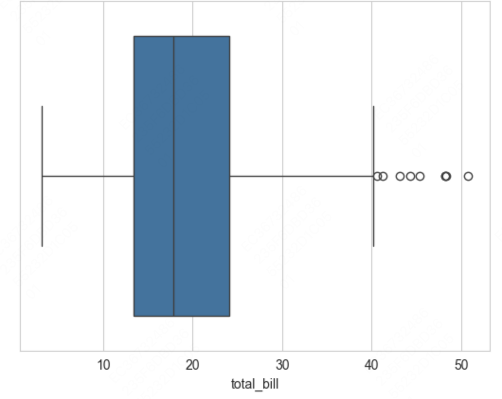

### 3.3 分组画图
&emsp;&emsp; 有时候我们需要对多个维度的分布进行对比分析，这个时候需要分组画图，具体的代码如下所示：
``` python 
# 分组绘制箱线图，分组因子是day，在x轴不同位置绘制
ax = sns.boxplot(x="day", y="total_bill", data=tips)
```
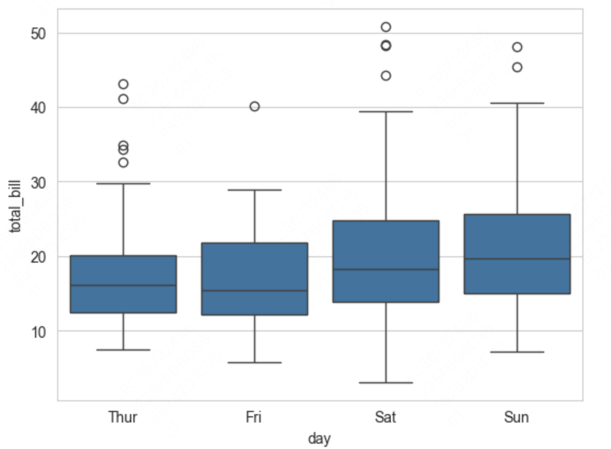

&emsp;&emsp;有时候我们不仅要分组，同时对每个分组内某个特征维度进行对比分析，具体的代码如下所示：
``` python 
# 分组箱线图，分子因子是smoker，不同的因子用不同颜色区分
ax = sns.boxplot(x="day", y="total_bill", hue="smoker",
                    data=tips, palette="Set3")

```
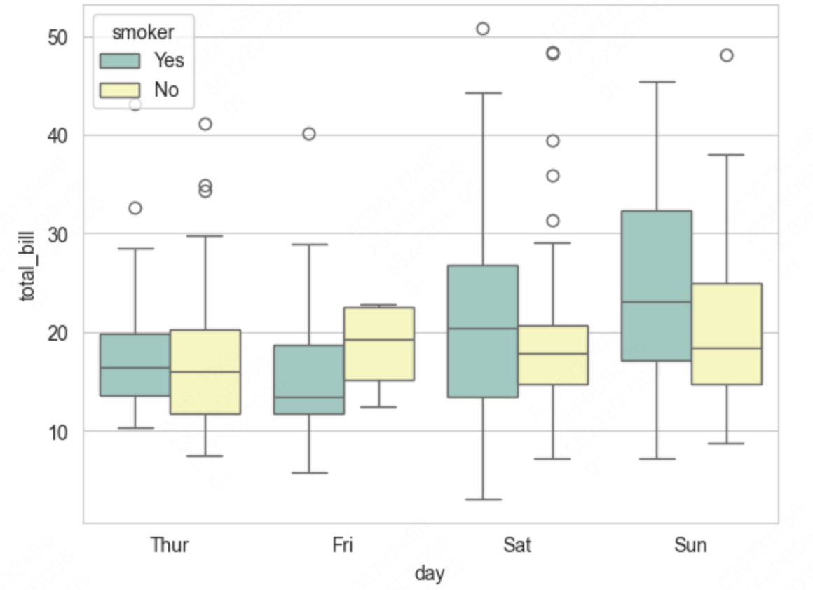
## 4 高阶用法
&emsp;&emsp; 有时候我们不仅需要画出数据的分布图，但是还想知道具体的数据点的分布，这个时候我们可以结合分布散点图来一起使用，具体的代码如下所示：
``` python 
# 箱线图+有分布趋势的散点图
# 图形组合也就是两条绘图语句一起运行就可以了，相当于图形覆盖了
ax = sns.boxplot(x="day", y="total_bill", data=tips)
ax = sns.swarmplot(x="day", y="total_bill", data=tips, color=".25")
```


## 🔍 5. 注意事项
- 箱线图非常适合于比较不同组数据的分布情况。
- 箱线图中的异常值通常用点表示，位于箱形图外的点表示这些值。
- 箱线图的四分位距（IQR）可以提供数据分布的稳定性和离散程度的信息。
- 在绘制箱线图时，考虑数据的规模和分布特性，选择合适的轴尺度（如对数尺度）。
## 🔍 6. 总结
&emsp;&emsp;Seaborn的箱线图是一种强大的工具，用于快速理解数据的分布情况和识别异常值。通过本博客的代码示例，我们学习了如何使用Seaborn绘制箱线图，并展示了如何通过箱线图探索不同类别数据的分布特征。希望这篇博客能够帮助你更好地利用箱线图进行数据探索和分析。


# Seabron-violinplot小提琴图
## 🎯 1. 基本介绍
&emsp;&emsp;小提琴图（Violin Plot）是一种用于展示数据分布的图表，它结合了箱线图的特点和密度图的连续性。这种图表可以展示数据的密度估计，从而提供关于数据分布形状和集中趋势的直观信息。
&emsp;&emsp;小提琴图其实是箱线图与核密度图的结合，箱线图展示了分位数的位置，小提琴图则展示了任意位置的密度，通过小提琴图可以知道哪些位置的密度较高。在图中，白点是中位数，黑色盒型的范围是下四分位点到上四分位点，细黑线表示须。外部形状即为核密度估计（在概率论中用来估计未知的密度函数，属于非参数检验方法之一）。
## 💡 2. 原理介绍
&emsp;&emsp;小提琴图背后的主要思想是使用核密度估计（KDE）来展示数据的分布。核密度估计是一种估计概率密度函数的方法，其公式如下：
$$f(x)=\frac{1}{nh}\sum_{i=1}^{n}K(\frac{x-x_i}{h})$$
&emsp;&emsp;其中：
>- f(x)是在点 x 处的密度估计。
n 是样本大小。
h 是带宽（Kernel width）。
K 是核函数，常用的核函数有高斯核、均匀核等。
$x_i$是样本数据点。

## 🔍 3. 画图实践
### 3.1 数据准备
&emsp;&emsp; 我们通过seaborn自带的数据对其进行相关的画图，具体的导入数据代码如下所示：
```python
import seaborn as sns
import matplotlib.pyplot as plt

# 使用Seaborn内置的tips数据集
tips = sns.load_dataset("tips")

	total_bill	tip	sex	smoker	day	time	size
0	16.99	1.01	Female	No	Sun	Dinner	2
1	10.34	1.66	Male	No	Sun	Dinner	3
2	21.01	3.50	Male	No	Sun	Dinner	3
3	23.68	3.31	Male	No	Sun	Dinner	2
4	24.59	3.61	Female	No	Sun	Dinner	4
...	...	...	...	...	...	...	...
239	29.03	5.92	Male	No	Sat	Dinner	3
240	27.18	2.00	Female	Yes	Sat	Dinner	2
241	22.67	2.00	Male	Yes	Sat	Dinner	2
242	17.82	1.75	Male	No	Sat	Dinner	2
243	18.78	3.00	Female	No	Thur	Dinner	2
```
### 3.2 单维画图
&emsp;&emsp; 在画小提琴图时，我们取单个维度指定方向即可，具体的代码如下所示：
``` python 
import seaborn as sns
sns.set_style("whitegrid")
tips = sns.load_dataset("tips")
# 绘制小提琴图
ax = sns.violinplot(x=tips["total_bill"])
```


### 3.3 分组画图
&emsp;&emsp; 有时候我们需要对多个维度的分布进行对比分析，这个时候需要分组画图，具体的代码如下所示：
``` python 
# 分组的小提琴图，同上面的箱线图一样通过X轴分组
ax = sns.violinplot(x="day", y="total_bill", data=tips)
```


&emsp;&emsp;有时候我们不仅要分组，同时对每个分组内某个特征维度进行对比分析，具体的代码如下所示：
``` python 
# 通过hue分组的小提琴图，相当于分组之后又分组
ax = sns.violinplot(x="day", y="total_bill", hue="smoker",
                        data=tips, palette="muted")
```

## 4 高阶用法
&emsp;&emsp; 有时候我们需要指定画图出现的顺序，具体的代码如下所示：
``` python 
# 调整x轴顺序，同样通过order参数
ax = sns.violinplot(x="time", y="tip", data=tips,
                    order=["Dinner", "Lunch"])
```


## 🔍 5. 注意事项
- 小提琴图非常适合于比较不同组数据的分布情况，尤其是当数据集较大时。
- 核密度估计的带宽（bw）选择对图表的形状有很大影响，过小或过大的带宽可能导致误导。
- 小提琴图可以与箱线图结合使用，以提供更多关于数据集中趋势和离散程度的信息。
## 🔍 6. 总结
&emsp;&emsp;Seaborn的小提琴图是一种展示数据分布的强大工具，它结合了箱线图和密度图的优点。通过本博客的代码示例，我们学习了如何使用Seaborn绘制小提琴图，并展示了如何通过小提琴图探索不同类别数据的分布特征。希望这篇博客能够帮助你更好地利用小提琴图进行数据探索和分析。


# Seabron-散点图
## 🎯 1. 基本介绍
&emsp;&emsp;散点图是一种用于展示两个变量之间关系的图表。在Seaborn库中，散点图可以通过scatterplot函数方便地绘制，它非常适合用于探索数据集中变量间的相关性、趋势或模式。
## 💡 2. 原理介绍
&emsp;&emsp;散点图本身不涉及复杂的数学公式，它简单地将数据点在二维平面上进行投影。每个数据点的位置由两个变量的值决定：$(x_i,y_i)$, 其中$x_i$和$y_i$分别代表第 i 个数据点在x轴和y轴上的值。
## 🔍 3. 画图实践
### 3.1 数据准备
&emsp;&emsp; 我们通过seaborn自带的数据对其进行相关的画图，具体的导入数据代码如下所示：
```python
import seaborn as sns
import matplotlib.pyplot as plt

# 使用Seaborn内置的tips数据集
tips = sns.load_dataset("tips")

	total_bill	tip	sex	smoker	day	time	size
0	16.99	1.01	Female	No	Sun	Dinner	2
1	10.34	1.66	Male	No	Sun	Dinner	3
2	21.01	3.50	Male	No	Sun	Dinner	3
3	23.68	3.31	Male	No	Sun	Dinner	2
4	24.59	3.61	Female	No	Sun	Dinner	4
...	...	...	...	...	...	...	...
239	29.03	5.92	Male	No	Sat	Dinner	3
240	27.18	2.00	Female	Yes	Sat	Dinner	2
241	22.67	2.00	Male	Yes	Sat	Dinner	2
242	17.82	1.75	Male	No	Sat	Dinner	2
243	18.78	3.00	Female	No	Thur	Dinner	2
```
### 3.2 基本散点图scatterplot
&emsp;&emsp; 如果画两个变量的时序上的变化关系的散点图，需要使用scatterplot函数，具体的代码如下所示：
``` python 
# 绘制散点图，展示总账单和消费金额的关系
sns.scatterplot(x="total_bill", y="tip", data=tips)

# 添加标题和轴标签
plt.title("Total Bill vs Tip Amount")
plt.xlabel("Total Bill")
plt.ylabel("Tip Amount")

# 显示图表
plt.show()
```


### 3.3 条形散点图stripplot
&emsp;&emsp; Stripplot（条形散点图）
>- Stripplot使用stripplot函数绘制。
它通常用于展示一个分类变量和一个连续变量之间的关系。
每个数据点在图上表示为一个条形，条形的x轴位置根据分类变量的类别确定。
适合于展示不同类别的分布情况，以及类别间的比较。
&emsp;&emsp; 具体的代码如下所示：
``` python 
# 分组的散点图
ax = sns.stripplot(x="day", y="total_bill", data=tips)
```
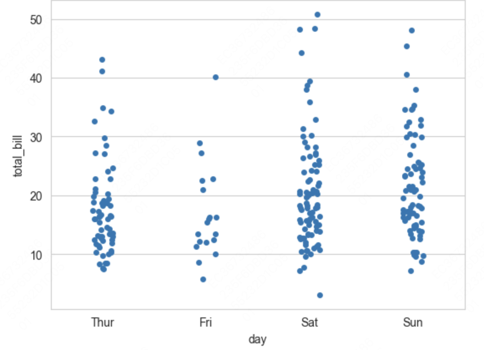

&emsp;&emsp;有时候我们不仅要分组，同时对每个分组内某个特征维度进行对比分析，具体的代码如下所示：
``` python 
# 通过hue分组的小提琴图，相当于分组之后又分组
ax = sns.violinplot(x="day", y="total_bill", hue="smoker",
                        data=tips, palette="muted")
```

## 4 高阶用法
&emsp;&emsp; 有时候我们需要指定画图出现的顺序，具体的代码如下所示：
``` python 
# 是不是想横着放呢，很简单的，x-y顺序换一下就好了
ax = sns.stripplot(x="total_bill", y="day", data=tips,jitter=True)
```
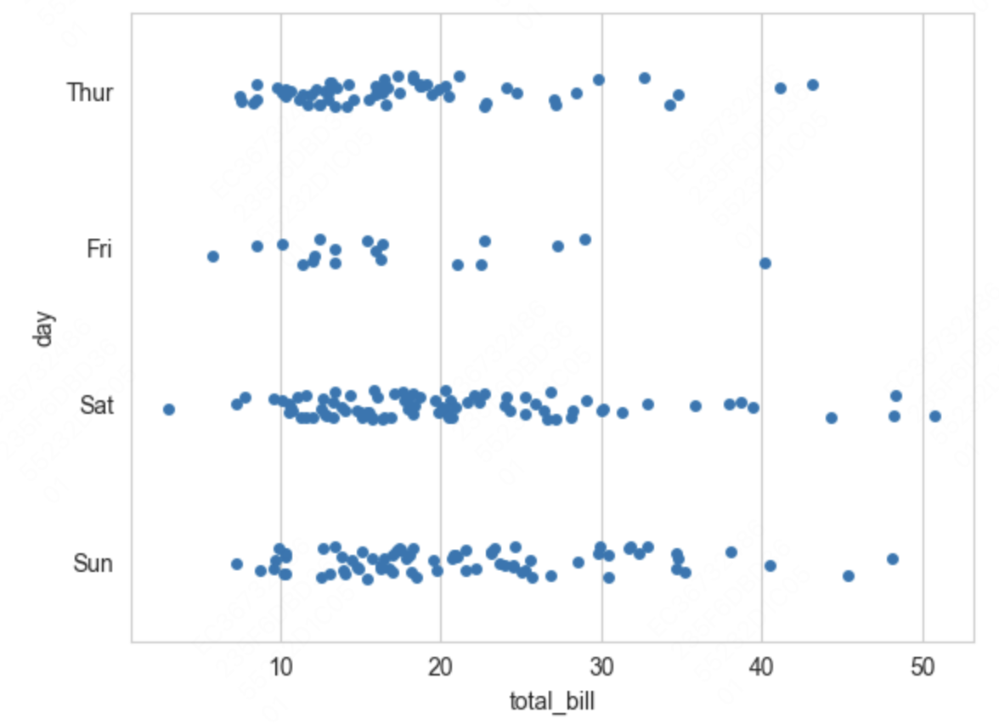
### 3.3 分布散点图swarmplot
&emsp;&emsp;swarmplt的参数和用法和stripplot的用法是一样的，只是表现形式不一样而已。具体的代码如下所示：
``` python 
# 分组的散点图
ax = sns.swarmplot(x="day", y="total_bill", data=tips)
```


## 🔍 4. 注意事项
- 散点图非常适合于展示两个连续变量之间的关系。
- 当数据集中的数据点数量非常大时，散点图可能会变得杂乱无章。在这种情况下，可以考虑使用六边形网格图（hexbin plot）或小提琴图。
- 散点图可以添加颜色或大小来表示第三个变量，从而提供更多的信息维度。
- 检查数据中的异常值或离群点，它们可能会影响对变量关系的解释。
## 🔍 5. 总结
&emsp;&emsp;Seaborn的散点图是一个直观的工具，用于探索和展示两个变量之间的关系。通过本博客的代码示例，我们学习了如何使用Seaborn绘制散点图，并展示了如何通过散点图分析数据集中的趋势和模式。希望这篇博客能够帮助你更好地利用散点图进行数据探索和分析。


# Seabron-因子变量catplot
## 🎯 1. 基本介绍
&emsp;&emsp;catplot 是 Seaborn 库中的一个高级接口，用于创建涉及分类变量（categorical variables）的多种图表。它基于 FacetGrid 类，可以自动处理多个图表的布局，非常适合于展示分类变量之间的比较和分布。
## 💡 2. 原理介绍
&emsp;&emsp;catplot 本身不涉及复杂的数学公式推导，它主要是数据可视化的实现。不过，根据选择的图表类型，可能会涉及到如下统计量的计算：
>- 频率或概率：用于计算每个分类的唯一值或出现的次数。
均值、中位数：用于展示分类变量的中心趋势。
箱型图参数：如四分位数和四分位距，用于展示数据的分散程度。
## 🔍 3. 画图实践
### 3.1 数据准备
&emsp;&emsp; 我们通过seaborn自带的数据对其进行相关的画图，具体的导入数据代码如下所示：
```python
import seaborn as sns
import matplotlib.pyplot as plt

# 使用Seaborn内置的tips数据集
tips = sns.load_dataset("tips")

	total_bill	tip	sex	smoker	day	time	size
0	16.99	1.01	Female	No	Sun	Dinner	2
1	10.34	1.66	Male	No	Sun	Dinner	3
2	21.01	3.50	Male	No	Sun	Dinner	3
3	23.68	3.31	Male	No	Sun	Dinner	2
4	24.59	3.61	Female	No	Sun	Dinner	4
...	...	...	...	...	...	...	...
239	29.03	5.92	Male	No	Sat	Dinner	3
240	27.18	2.00	Female	Yes	Sat	Dinner	2
241	22.67	2.00	Male	Yes	Sat	Dinner	2
242	17.82	1.75	Male	No	Sat	Dinner	2
243	18.78	3.00	Female	No	Thur	Dinner	2
```
### 3.2 画图实践
&emsp;&emsp; 如果画两个变量关系图，具体的代码如下所示：
``` python 
import seaborn as sns
import matplotlib.pyplot as plt

# 绘制因子变量图形
g = sns.catplot(x="day", y="total_bill", hue="smoker", data=tips, kind="bar")

# 设置图形标题
g.fig.suptitle("Title of the plot", y=1.03)

# 显示图形
plt.show()
```
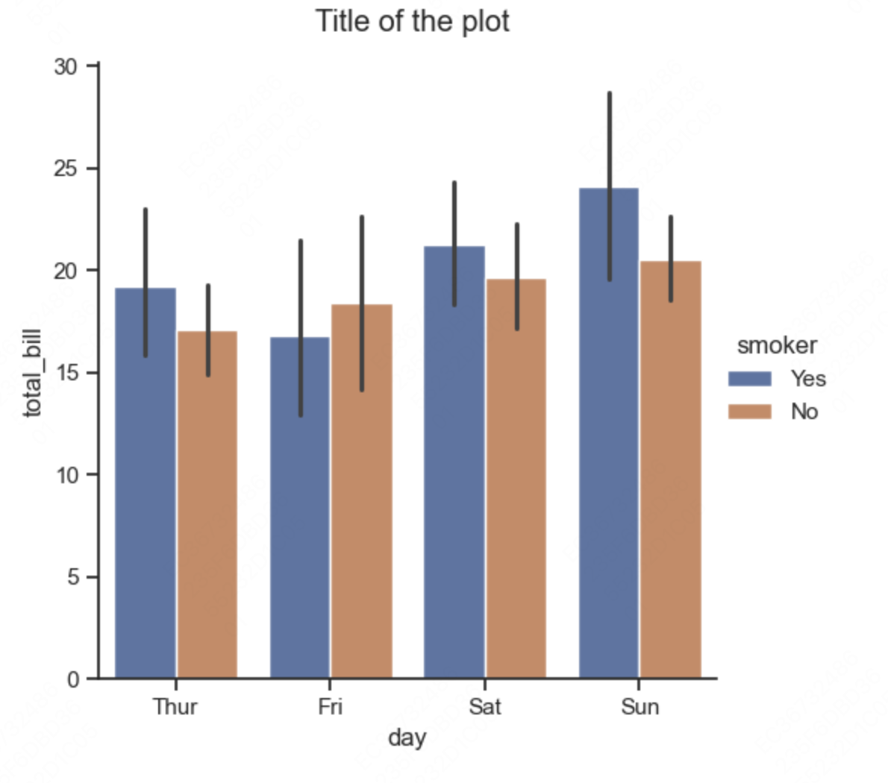

## 🔍 4. 注意事项
- catplot 的 kind 参数可以设置为 strip、swarm、box、violin 等，以选择不同的图表类型。
catplot 默认会为每个分类变量生成一个子图，可以通过设置 col、row、col_wrap 等参数来调整布局。
- 在使用 catplot 时，注意数据的规模和分类变量的数量，以避免生成过于拥挤的图表。
- 可以通过 height 和 aspect 参数调整子图的大小和比例。
## 🔍 5. 总结
&emsp;&emsp;Seaborn 的 catplot 是一个功能强大的工具，用于探索分类变量之间的关系和分布。通过本博客的代码示例，我们学习了如何使用 catplot 绘制箱型图，并展示了如何通过图表分析不同类别的数据分布。希望这篇博客能够帮助你更好地利用 catplot 进行数据探索和分析。


# Seabron-barplot直方图
## 🎯 1. 基本介绍
&emsp;&emsp;直方图是一种常用于展示数据分布的统计图表，它通过将数据分组并计算每组的频数或概率来展示数据的分布情况。在Python中，Seaborn库提供了一个简单易用的barplot函数来绘制直方图。
## 💡 2. 原理介绍
&emsp;&emsp;直方图的计算主要涉及以下几个步骤：
>- 分组：将数据分为若干个连续的区间，这些区间称为“桶”（bins）。
计数：计算每个桶中的数据点数量。
计算频率/概率：如果需要，将每组的频数除以总数据点数，得到每组的频率或概率。上的值。
## 🔍 3. 画图实践
### 3.1 数据准备
&emsp;&emsp; 我们通过seaborn自带的数据对其进行相关的画图，具体的导入数据代码如下所示：
```python
import seaborn as sns
import matplotlib.pyplot as plt

# 使用Seaborn内置的tips数据集
tips = sns.load_dataset("tips")

	total_bill	tip	sex	smoker	day	time	size
0	16.99	1.01	Female	No	Sun	Dinner	2
1	10.34	1.66	Male	No	Sun	Dinner	3
2	21.01	3.50	Male	No	Sun	Dinner	3
3	23.68	3.31	Male	No	Sun	Dinner	2
4	24.59	3.61	Female	No	Sun	Dinner	4
...	...	...	...	...	...	...	...
239	29.03	5.92	Male	No	Sat	Dinner	3
240	27.18	2.00	Female	Yes	Sat	Dinner	2
241	22.67	2.00	Male	Yes	Sat	Dinner	2
242	17.82	1.75	Male	No	Sat	Dinner	2
243	18.78	3.00	Female	No	Thur	Dinner	2
```
### 3.2 画图实践
&emsp;&emsp; 如果画两个变量的数量变化，需要用到柱状图，需要使用barplot函数，具体的代码如下所示：
``` python 
# 注意看看Y轴，看到没，统计函数默认是 mean，
import seaborn as sns
sns.set_style("whitegrid")
tips = sns.load_dataset("tips")
ax = sns.barplot(x="day", y="total_bill", data=tips,ci=0)
```


&emsp;&emsp;有时候我们不仅要分组，同时对每个分组内某个特征维度进行对比分析，具体的代码如下所示：
``` python 
# 分组的柱状图
ax = sns.barplot(x="day", y="total_bill", hue="sex", data=tips,ci=0)
```

## 4 高阶用法
&emsp;&emsp; 有时候我们需要对因子变量计数，然后绘制条形图，这个时候我们可以使用countplot，具体的代码如下所示：
``` python 
import seaborn as sns
sns.set(style="darkgrid")
titanic = sns.load_dataset("titanic")
ax = sns.countplot(x="class", data=titanic)
```

### 3.3 分布散点图swarmplot
&emsp;&emsp;swarmplt的参数和用法和stripplot的用法是一样的，只是表现形式不一样而已。具体的代码如下所示：
``` python 
# 分组的散点图
ax = sns.swarmplot(x="day", y="total_bill", data=tips)
```


&emsp;&emsp;同样的分组统计的方法如下所示：
```python 
# 分组绘图
import matplotlib.pyplot as plt 
ax = sns.countplot(x="class", hue="who", data=titanic)
plt.show()
# 如果是横着放，x用y替代
ax = sns.countplot(y="class", hue="who", data=titanic)

```
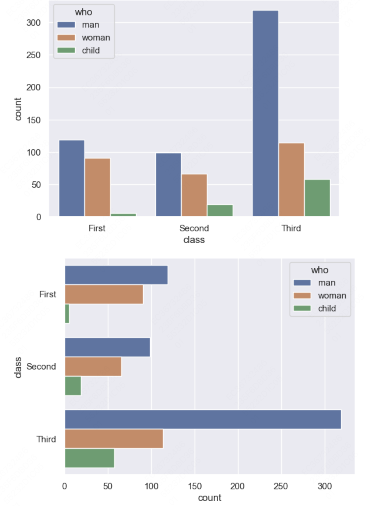

## 🔍 4. 注意事项
- 选择合适的桶数对于直方图的形状和解释至关重要。桶数太少可能导致数据过于集中，而桶数太多则可能导致数据过于分散。
- Seaborn的barplot函数可以通过bins参数来指定桶数，或者使用hist函数来自动计算桶数。
- 直方图可以用于展示连续数据的分布，但对于分类数据，应使用柱状图。
## 🔍 5. 总结
&emsp;&emsp;直方图是一种直观的图表，用于展示数据的分布情况。通过Seaborn的barplot函数，我们可以轻松地绘制直方图，并探索数据的分布特征。希望这篇博客能够帮助你更好地理解直方图，并将其应用于数据探索和分析中。


# Seabron-折线图
## 🎯 1. 基本介绍
&emsp;&emsp;折线图是最常见的图表类型之一，用于展示数据随时间或有序类别变化的趋势。在Seaborn库中，可以通过lineplot函数轻松创建折线图，它提供了丰富的定制选项，使得折线图既美观又信息丰富。
&emsp;&emsp;这里又说一遍散点图，是为了和前面的因子变量散点图相区分，前面的因子变量散点图，讲的是不同因子水平的值绘制的散点图，而这里是两个数值变量值散点图关系。为什么要用lmplot呢，说白了就是，先将这些散点画出来，然后在根据散点的分布情况拟合出一条直线。但是用lmplot总觉得不好，没有用scatter来得合适。
## 💡 2. 原理介绍
&emsp;&emsp;折线图通常不涉及复杂的数学公式，它主要用于数据的可视化。不过，折线图的绘制基于以下概念：
>- x轴：通常表示时间或有序的类别。
y轴：表示数据的数值。
线段：连接各个数据点，形成折线。
## 🔍 3. 画图实践
### 3.1 数据准备
&emsp;&emsp; 我们通过seaborn自带的数据对其进行相关的画图，具体的导入数据代码如下所示：
```python
import seaborn as sns
import matplotlib.pyplot as plt

# 创建一个示例数据集
months = ['Jan', 'Feb', 'Mar', 'Apr', 'May', 'Jun']
temperatures = [7, 6.5, 9, 14, 18, 22]

# 将数据转换为DataFrame
df = pd.DataFrame({'Month': months, 'Temperature': temperatures})

```
### 3.2 画图实践
&emsp;&emsp; 我们展示上述数据中各个变量之间的关系，具体的代码如下所示：
``` python 
# 绘制折线图
sns.lineplot(data=df, x='Month', y='Temperature')

# 添加标题和轴标签
plt.title('Monthly Temperatures')
plt.xlabel('Month')
plt.ylabel('Temperature')

# 显示图表
plt.show()
```
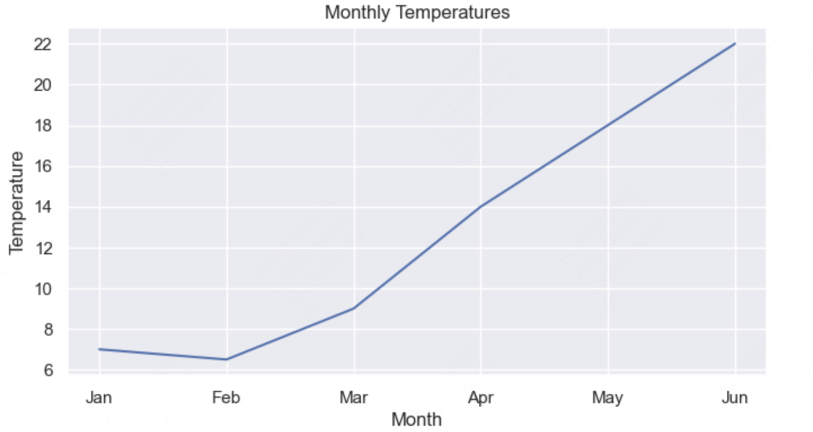

## 🔍 4. 注意事项
- 确保x轴的数据是有序的，以便折线图能够正确地反映趋势。
- 使用style参数可以改变折线图的线条样式，如实线、虚线等。
- markers参数可以用来控制是否在每个数据点上显示标记。
- ci参数用于控制是否绘制置信区间，这在展示数据的不确定性时很有用。
## 🔍 5. 总结
&emsp;&emsp;Seaborn的lineplot函数是一个简单而强大的工具，用于创建折线图并展示数据随时间或有序类别的变化趋势。通过本博客的代码示例，我们学习了如何使用lineplot绘制折线图，并定制图表的样式。希望这篇博客能够帮助你更好地利用折线图进行数据可视化和趋势分析。


# Seabron-回归图
## 🎯 1. 基本介绍
&emsp;&emsp;在数据分析中，回归图是一种展示两个变量之间关系的图表。Seaborn库提供了一个名为regplot的函数，用于绘制散点图并添加线性回归线，这使得观察数据趋势和进行线性回归分析变得直观。
## 💡 2. 原理介绍
&emsp;&emsp;线性回归模型的基本形式为：
$$y=wx+b$$
&emsp;&emsp;其中y为因变量，x为自变量，w为自变量的参数，b为常量
## 🔍 3. 画图实践
### 3.1 数据准备
&emsp;&emsp; 我们通过seaborn自带的数据对其进行相关的画图，具体的导入数据代码如下所示：
```python
import seaborn as sns
import matplotlib.pyplot as plt

# 使用Seaborn内置的tips数据集
tips = sns.load_dataset("tips")

	total_bill	tip	sex	smoker	day	time	size
0	16.99	1.01	Female	No	Sun	Dinner	2
1	10.34	1.66	Male	No	Sun	Dinner	3
2	21.01	3.50	Male	No	Sun	Dinner	3
3	23.68	3.31	Male	No	Sun	Dinner	2
4	24.59	3.61	Female	No	Sun	Dinner	4
...	...	...	...	...	...	...	...
239	29.03	5.92	Male	No	Sat	Dinner	3
240	27.18	2.00	Female	Yes	Sat	Dinner	2
241	22.67	2.00	Male	Yes	Sat	Dinner	2
242	17.82	1.75	Male	No	Sat	Dinner	2
243	18.78	3.00	Female	No	Thur	Dinner	2
```
### 3.2 画图实践
&emsp;&emsp; 如果画两个变量的时序上的变化关系的散点图，需要使用lmplot函数，具体的代码如下所示：
``` python 
# 线性回归图
import seaborn as sns; sns.set(color_codes=True)
tips = sns.load_dataset("tips")
g = sns.lmplot(x="total_bill", y="tip", data=tips)
```


&emsp;&emsp;有时候我们不仅要分组，同时对每个分组内某个特征维度进行对比分析，具体的代码如下所示：
``` python 
# 分组绘图，不同的组用不同的形状标记
g = sns.lmplot(x="total_bill", y="tip", hue="smoker", 
                data=tips,markers=["o", "x"])
```
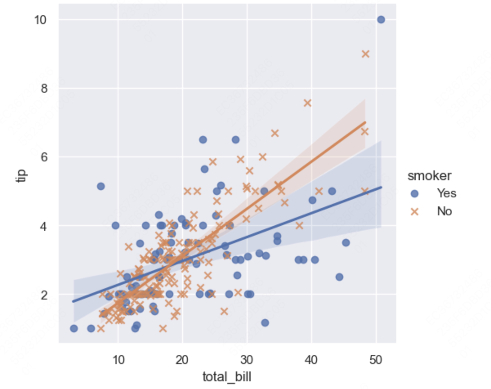

&emsp;&emsp;如果想将分组的图片分开展示，具体的代码如下所示：
``` python 
# 不仅分组，还分开不同的子图绘制，用col参数控制
g = sns.lmplot(x="total_bill", y="tip", col="smoker", data=tips)

```


## 🔍 4. 注意事项
- lmplot函数中的scatter_kws参数可以用来设置散点的样式，如透明度（alpha）。
- 可以通过line_kws参数来自定义回归线的外观，例如颜色（color）和线型（linestyle）。
- 线性回归模型假设两个变量之间存在线性关系。如果数据点的分布显示出非线性趋势，可能需要考虑使用其他类型的回归模型。
- 检查数据中的异常值，它们可能会对回归线的拟合产生较大影响。
## 🔍 5. 总结
&emsp;&emsp;Seaborn的lmplot函数是一个直观的工具，用于展示两个变量之间的线性关系。通过本博客的代码示例，我们学习了如何使用lmplot绘制回归图，并分析了数据点之间的关系。希望这篇博客能够帮助你更好地利用回归图进行数据探索和分析。


# Seabron-直方图
## 🎯 1. 基本介绍
&emsp;&emsp;直方图是一种用于展示数据分布的统计图表，它通过将数据分成若干个连续的区间（通常称为“桶”或“bins”），并计算每个区间内的数据点数量来展示数据的分布情况。Seaborn 的 histplot 函数提供了一种灵活且美观的方式来绘制直方图。
## 💡 2. 原理介绍
&emsp;&emsp;直方图的生成过程涉及以下步骤：
>- 数据分桶：将数据范围划分为多个连续的非重叠区间。
计数：计算每个桶内的数据点数量。
绘制：将每个桶的计数以条形的形式展示出来。
直方图的高度（或长度）表示每个桶内的计数，而桶的宽度则对应数据的区间范围。
## 🔍 3. 画图实践
### 3.1 数据准备
&emsp;&emsp; 我们通过seaborn自带的数据对其进行相关的画图，具体的导入数据代码如下所示：
```python
import seaborn as sns
import matplotlib.pyplot as plt

# 使用Seaborn内置的tips数据集
tips = sns.load_dataset("tips")

	total_bill	tip	sex	smoker	day	time	size
0	16.99	1.01	Female	No	Sun	Dinner	2
1	10.34	1.66	Male	No	Sun	Dinner	3
2	21.01	3.50	Male	No	Sun	Dinner	3
3	23.68	3.31	Male	No	Sun	Dinner	2
4	24.59	3.61	Female	No	Sun	Dinner	4
...	...	...	...	...	...	...	...
239	29.03	5.92	Male	No	Sat	Dinner	3
240	27.18	2.00	Female	Yes	Sat	Dinner	2
241	22.67	2.00	Male	Yes	Sat	Dinner	2
242	17.82	1.75	Male	No	Sat	Dinner	2
243	18.78	3.00	Female	No	Thur	Dinner	2
```
### 3.2 画图实践
&emsp;&emsp; 我们将展示了总账单金额的分布情况，其中x轴为账单金额，y轴为每个金额区间的频数。kde=True 参数添加了核密度估计曲线，显示了数据的密度分布，具体的代码如下所示：
``` python 
# 绘制直方图，展示总账单金额的分布
sns.histplot(tips['total_bill'], bins=20, kde=True)

# 添加标题和轴标签
plt.title("Distribution of Total Bill")
plt.xlabel("Total Bill")
plt.ylabel("Frequency")

# 显示图表
plt.show()
```
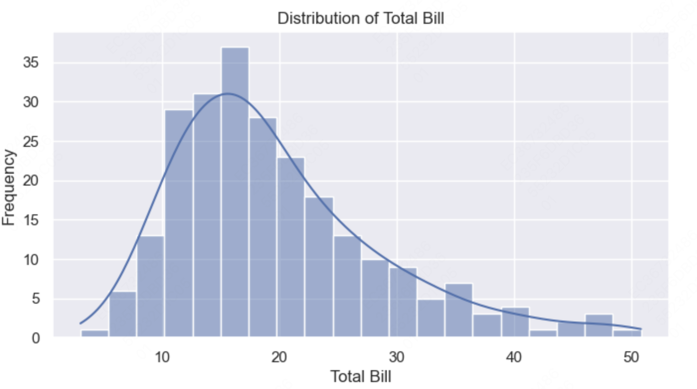

&emsp;&emsp;有时候我们不想展示柱状图可以设置为，具体的代码如下所示：
``` python 
# 只绘制核密度曲线，不绘制直返图
ax = sns.distplot(x, rug=True, hist=False)
```
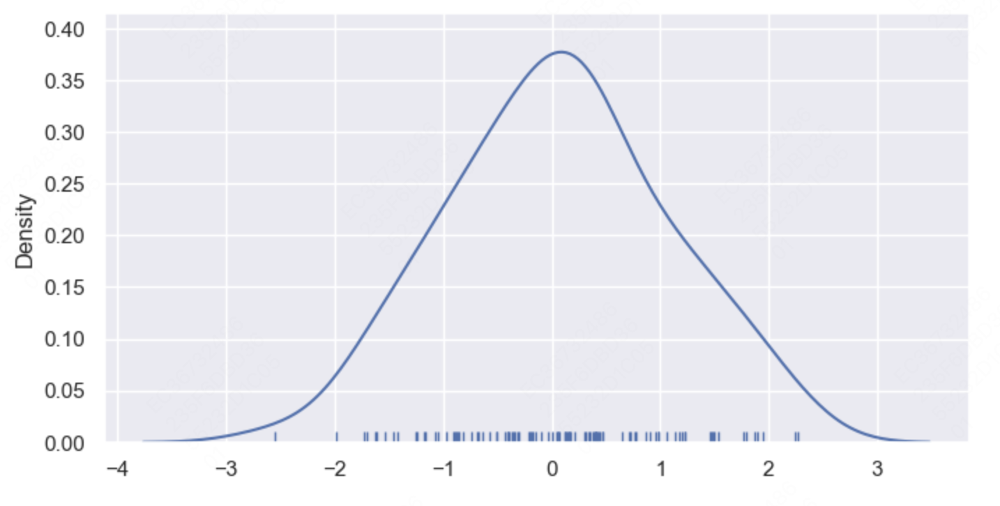

## 🔍 4. 注意事项
- histplot 函数的 bins 参数用于指定桶的数量，可以根据数据的分布和需求进行调整。
kde 参数用于控制是否绘制核密度估计曲线，这有助于更平滑地展示数据分布。
- 可以通过 color 参数自定义直方图的颜色，使图表更加美观。
- 在对大数据集使用直方图时，可能需要调整 bins 参数以避免图表过于拥挤。
## 🔍 5. 总结
&emsp;&emsp;Seaborn 的 histplot 函数提供了一种直观且美观的方式来绘制直方图，帮助我们探索和理解数据的分布情况。通过本博客的代码示例，我们学习了如何使用 histplot 绘制直方图，并展示了如何通过直方图分析数据分布。希望这篇博客能够帮助你更好地利用直方图进行数据探索和分析。


# Seabron-双变量关系图jointplot
## 🎯 1. 基本介绍
&emsp;&emsp;jointplot 是 Seaborn 库中的一个强大工具，用于可视化两个变量的联合分布。它结合了散点图、直方图、核密度估计（KDE）等多种图表类型，提供了对数据分布和关系的深入理解。
## 💡 2. 原理介绍
&emsp;&emsp;jointplot 的核心在于展示两个变量的分布和它们之间的关系，涉及以下几个统计概念：
>- 联合分布：表示两个随机变量取值的概率分布。
边缘分布：在联合分布中，分别固定一个变量，观察另一个变量的分布。
散点图：展示两个变量之间的点对点关系。
KDE：核密度估计，用于平滑地展示数据的概率密度函数。
## 🔍 3. 画图实践
### 3.1 数据准备
&emsp;&emsp; 我们通过seaborn自带的数据对其进行相关的画图，具体的导入数据代码如下所示：
```python
import seaborn as sns
import matplotlib.pyplot as plt

# 使用Seaborn内置的tips数据集
tips = sns.load_dataset("tips")

	total_bill	tip	sex	smoker	day	time	size
0	16.99	1.01	Female	No	Sun	Dinner	2
1	10.34	1.66	Male	No	Sun	Dinner	3
2	21.01	3.50	Male	No	Sun	Dinner	3
3	23.68	3.31	Male	No	Sun	Dinner	2
4	24.59	3.61	Female	No	Sun	Dinner	4
...	...	...	...	...	...	...	...
239	29.03	5.92	Male	No	Sat	Dinner	3
240	27.18	2.00	Female	Yes	Sat	Dinner	2
241	22.67	2.00	Male	Yes	Sat	Dinner	2
242	17.82	1.75	Male	No	Sat	Dinner	2
243	18.78	3.00	Female	No	Thur	Dinner	2
```
### 3.2 画图实践
&emsp;&emsp; 我们展示total_bill和tip之间的关系，具体的代码如下所示：
``` python 
# 默认绘制双变量的散点图，计算两个变量的直方图，计算两个变量的相关系数和置信度
import numpy as np, pandas as pd; np.random.seed(0)
import seaborn as sns; sns.set(style="white", color_codes=True)
tips = sns.load_dataset("tips")
g = sns.jointplot(x="total_bill", y="tip", data=tips)
```


&emsp;&emsp;我们还是可以将二者的拟合曲线进行展示，具体的代码如下所示：
``` python 
# 通过kind参数，除了绘制散点图，还要绘制拟合的直线，拟合的核密度图
g = sns.jointplot(x="total_bill", y="tip", data=tips, kind="reg")
```
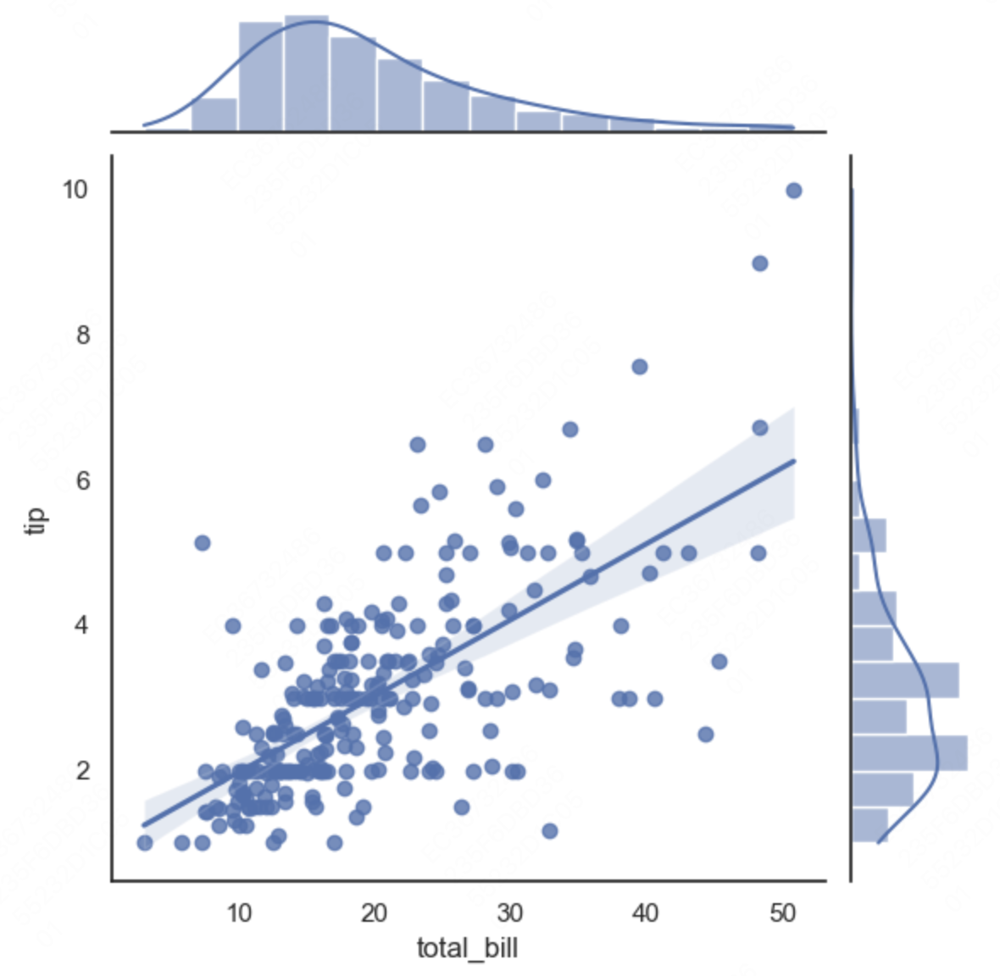

## 🔍 4. 注意事项
- jointplot 的 kind 参数可以设置为 scatter、hex、resid、reg 等，以选择不同的图表类型。
- marginal_kws 参数可以用来自定义边缘直方图的样式。
- joint_kws 参数可以用来自定义联合图（如散点图）的样式。
- 核密度估计（KDE）通过平滑数据分布来提供对数据分布的估计，可以通过 stat 参数选择不同的统计方法。
## 🔍 5. 总结
&emsp;&emsp;Seaborn 的 jointplot 是一个多功能的图表绘制工具，它结合了多种图表类型，帮助我们探索和理解两个变量之间的联合分布和关系。通过本博客的代码示例，我们学习了如何使用 jointplot 绘制双变量关系图，并分析了数据点之间的相互作用。希望这篇博客能够帮助你更好地利用 jointplot 进行数据探索和分析。


# Seabron-多变量关系图Pairplot
## 🎯 1. 基本介绍
&emsp;&emsp;pairplot 是 Seaborn 库中的一个多功能图表，用于绘制数据集中所有可能的成对关系。它生成一个网格图，每个单元格显示一个变量对的分布图，如散点图、直方图或 KDE 曲线，非常适合于初步的数据探索和可视化。
&emsp;&emsp;这里又说一遍散点图，是为了和前面的因子变量散点图相区分，前面的因子变量散点图，讲的是不同因子水平的值绘制的散点图，而这里是两个数值变量值散点图关系。为什么要用lmplot呢，说白了就是，先将这些散点画出来，然后在根据散点的分布情况拟合出一条直线。但是用lmplot总觉得不好，没有用scatter来得合适。
## 💡 2. 原理介绍
&emsp;&emsp;pairplot 通常不涉及复杂的数学公式推导，它主要用于数据可视化。然而，它依赖于以下几种图形和统计概念：
>- 散点图：用于展示两个连续变量之间的关系。
直方图：用于展示一个变量的分布。
核密度估计（KDE）：用于平滑地展示数据的概率密度函数。
## 🔍 3. 画图实践
### 3.1 数据准备
&emsp;&emsp; 我们通过seaborn自带的数据对其进行相关的画图，具体的导入数据代码如下所示：
```python
import seaborn as sns
sns.set(style="ticks", color_codes=True)
iris = sns.load_dataset("iris")

	sepal_length	sepal_width	petal_length	petal_width	species
0	5.1	3.5	1.4	0.2	setosa
1	4.9	3.0	1.4	0.2	setosa
2	4.7	3.2	1.3	0.2	setosa
3	4.6	3.1	1.5	0.2	setosa
4	5.0	3.6	1.4	0.2	setosa
...	...	...	...	...	...
145	6.7	3.0	5.2	2.3	virginica
146	6.3	2.5	5.0	1.9	virginica
147	6.5	3.0	5.2	2.0	virginica
148	6.2	3.4	5.4	2.3	virginica
149	5.9	3.0	5.1	1.8	virginica

```
### 3.2 画图实践
&emsp;&emsp; 我们展示上述数据中各个变量之间的关系，具体的代码如下所示：
``` python 
g = sns.pairplot(iris)
```
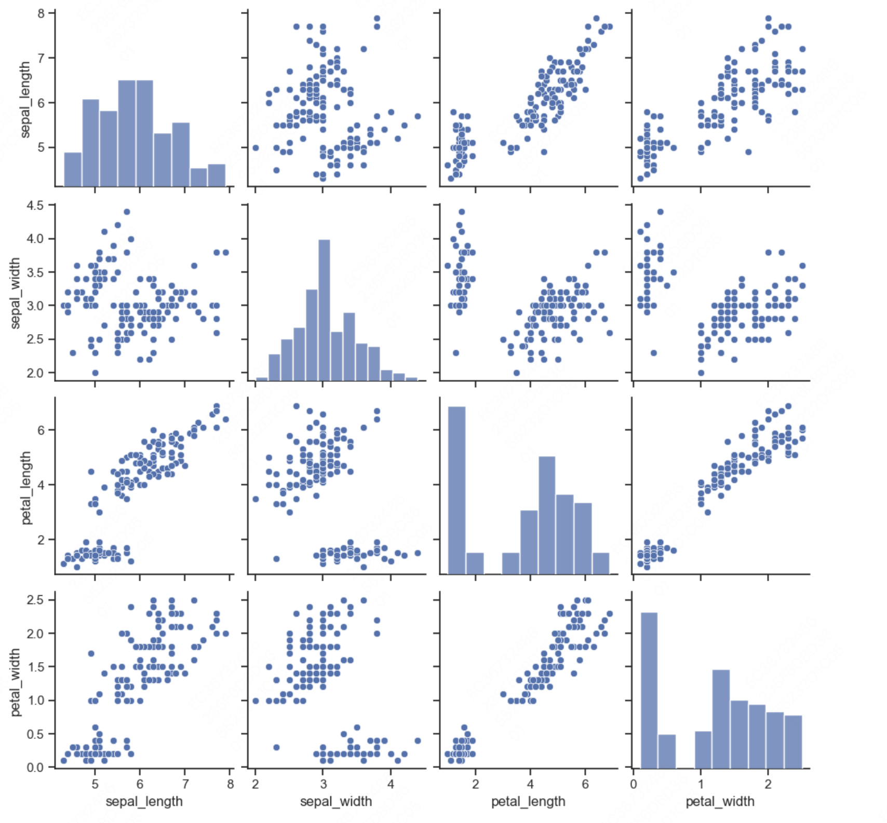

&emsp;&emsp;我们分组展示，具体的代码如下所示：
``` python 
# 分组的变量关系图，似乎很厉害啊
g = sns.pairplot(iris, hue="species")
```
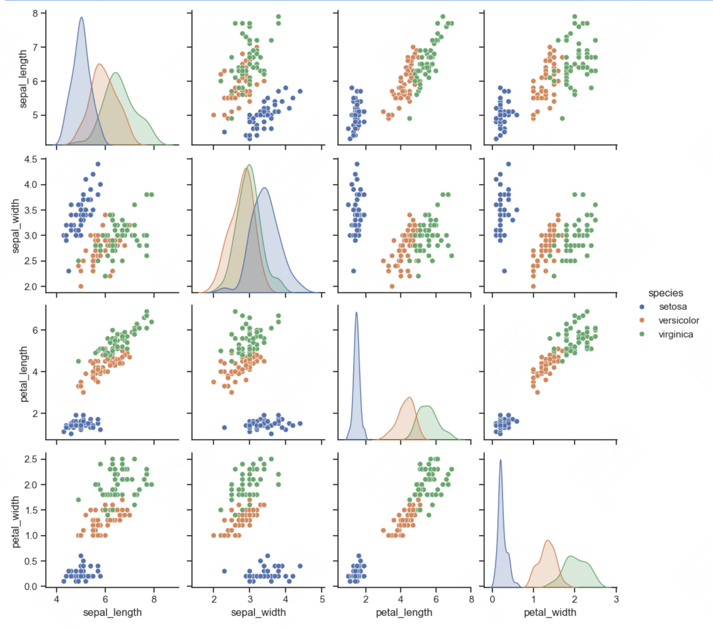

## 🔍 4. 注意事项
- pairplot 默认使用散点图来展示连续变量之间的关系，使用直方图来展示变量的分布。
- hue 参数可以用来根据分类变量对数据进行分组，并为每个组分配不同的颜色。
- diag_kind 参数可以控制对角线上的图表类型，如 'auto'、'hist' 或 'kde'。
- markers 参数可以控制散点图中的标记类型，用于不同的数据点形状。
## 🔍 5. 总结
&emsp;&emsp;Seaborn 的 pairplot 是一个强大的数据探索工具，它通过矩阵图的形式，快速展示数据集中所有变量对的关系。通过本博客的代码示例，我们学习了如何使用 pairplot 进行数据可视化，并分析了不同变量之间的关系。希望这篇博客能够帮助你更好地利用 pairplot 进行数据探索和分析。


# Python最美画图Plotly
## 🎯 1. 基本介绍
&emsp;&emsp;Plotly 是一个交互式的数据可视化工具，在数据科学和数据可视化领域得到了广泛的应用。它提供了丰富的绘图类型和高度可定制的图表，可以用于创建漂亮的、交互式的数据可视化图形。
&emsp;&emsp;Plotly 可以通过 Python、R、JavaScript 等多种编程语言进行使用，并且提供了各种形式的 API、SDK 和工具包。其中，Plotly Python 是 Plotly 提供的一个 Python 库，它可以帮助开发者在 Python 环境中进行数据处理和数据可视化。
&emsp;&emsp;与 Seaborn、Matplotlib 等数据可视化库相比，Plotly 具有更高的交互性和丰富的功能。它可以创建动态图表、可缩放的图表、3D 图表等，并且可以在其中添加标签、注释、图例和颜色映射等
## 💡 2. 环境安装
&emsp;&emsp;通常情况下，我们都是用pandas来处理数据，如果直接用plotly原生态的去画图，会导致学习生成较高，且操作较为复杂，因此，我们通过将pandas和plotly一起来连用，既可以保留了plotly画图的美观，同时也使得整个操作相对比较简单，具体的环境配置如下所示：
``` python 
pip install chart_studio -i https://pypi.tuna.tsinghua.edu.cn/simple
pip install pyarrow -i https://pypi.tuna.tsinghua.edu.cn/simple
pip install matplotlib -i https://pypi.tuna.tsinghua.edu.cn/simple
pip install seaborn -i https://pypi.tuna.tsinghua.edu.cn/simple
pip install plotly -i https://pypi.tuna.tsinghua.edu.cn/simple
pip install cufflinks -i https://pypi.tuna.tsinghua.edu.cn/simple
pip install pandas -i https://pypi.tuna.tsinghua.edu.cn/simple
pip install numpy -i https://pypi.tuna.tsinghua.edu.cn/simple

```
&emsp;&emsp;安装完上述必备的包之后，我们需要再每次运行的代码之前进行相关的配置，具体的代码如下所示：
``` python 
import plotly.graph_objs as go
import chart_studio.plotly as py
import cufflinks as cf
from plotly.offline import iplot
import pandas as pd
import numpy as np
cf.go_offline()
cf.set_config_file(world_readable=True, theme="pearl")
from IPython.core.interactiveshell import InteractiveShell
InteractiveShell.ast_node_interactivity = "all" 

```
## 🔍 3. 注意事项
- Plotly Express是基于Plotly的高级接口，提供了简化的函数来绘制多种图表。
- Graph Objects是Plotly的低级接口，允许更细粒度的图表定制。
- Plotly图表默认在浏览器中显示，可以通过fig.show()在Jupyter Notebook中显示。
- Plotly提供了丰富的图表类型，包括条形图、散点图、折线图、热力图、3D图表等。

## 🔍 4. 总结
&emsp;&emsp;Plotly是一个功能强大的交互式图表库，它使得创建美观、交互性强的数据可视化变得简单。通过本博客的代码示例，我们学习了如何使用Plotly Express和Graph Objects绘制基本的条形图和散点图。希望这篇博客能够帮助你更好地利用Plotly进行数据可视化。


# Plotly-折线图
## 🎯 1. 基本介绍
&emsp;&emsp;折线图是数据可视化中用于展示数据随时间或有序类别变化趋势的经典图表类型。Plotly是一个交互式图表库，它能够创建丰富、动态且高度可定制的折线图，为用户提供了探索数据的全新方式。
## 🔍 2. 画图实践
### 2.1 数据准备
&emsp;&emsp; 我们准备的数据格式如下所示：
```python
# plotly standard imports
import plotly.graph_objs as go
import chart_studio.plotly as py

# Cufflinks wrapper on plotly
import cufflinks

# Data science imports
import pandas as pd
import numpy as np

# Options for pandas
pd.options.display.max_columns = 30

# Display all cell outputs
from IPython.core.interactiveshell import InteractiveShell

InteractiveShell.ast_node_interactivity = "all"

from plotly.offline import iplot
import time
cufflinks.go_offline()

# Set global theme
cufflinks.set_config_file(world_readable=True, theme="pearl")


user_id	item_id	category	behavior	time	date	hour
0	565283	1691396	903809	pv	1512116234	2017-12-01	16
1	312117	4381601	982926	pv	1511829760	2017-11-28	8
2	253828	5082804	2885642	pv	1512228469	2017-12-02	23
3	776488	5048431	4801426	pv	1512302885	2017-12-03	20
4	884522	1649923	4145813	pv	1511870178	2017-11-28	19
5	502737	4275081	600175	pv	1511701857	2017-11-26	21
6	986023	4355178	3898483	pv	1511707644	2017-11-26	22
7	103840	3793189	317735	pv	1511961741	2017-11-29	21
8	397937	3642490	2520377	pv	1512289398	2017-12-03	16
9	1986	1400268	2520377	pv	1511693349	2017-11-26	18
10	784120	5019683	4145813	pv	1512089120	2017-12-01	8
11	865508	2359495	982926	pv	1511685415	2017-11-26	16

```
### 2.2 画图实践
&emsp;&emsp; 我们根据上述的数据画出不同时间段不同行为的折线图，具体的代码如下所示：
``` python 
import plotly.express as px

# 使用color参数设置不同类别的颜色
fig = px.line(day_behavior_cnt, x="days", y="hour", color="behavior", markers=True, title="用户不同评分随时间变化趋势")

# 显示图表
fig.show()
```


&emsp;&emsp;如果数据是两列，则可以用如下的方法：
``` python 
date	pv	uv
0	2017-11-25	52043	47680
1	2017-11-26	53585	49167
2	2017-11-27	50657	46585
3	2017-11-28	49366	45431
4	2017-11-29	51323	47284
5	2017-11-30	51397	47392
6	2017-12-01	54342	49805
7	2017-12-02	68838	63070
8	2017-12-03	68449	62685

pv_daily.iplot(
    x='date',
    y=['pv', 'uv'],
    kind='scatter',
    mode="lines+markers",
    opacity=0.5,
    size=8,
    symbol=1,
    xTitle="date",
    yTitle="cnt",
    title=go.layout.Title(text="pv vs uv " ,x=0.5)
)

```
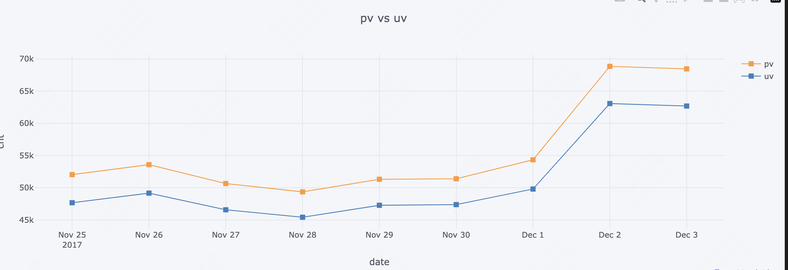
## 🔍 3. 高阶用法
&emsp;&emsp;我们也可以很方便的设置散点图并对其进行线性的拟合，并查看线性拟合的效果，具体的代码如下所示：
``` python 
tds.sort_values("read_time").iplot(
    x="read_time",
    y="read_ratio",
    xTitle="Read Time",
    yTitle="Reading Percent",
    text="title",
    mode="markers+lines",
    bestfit=True,
    bestfit_colors=["blue"],
    title="Reading Percent vs Reading Time",
)

```


&emsp;&emsp;如果要对其中某个列别进行分类的话，可以采用如下的代码：
``` python 
df.iplot(
    x="read_time",
    y="read_ratio",
    categories="publication",
    xTitle="Read Time",
    yTitle="Reading Percent",
    title="Reading Percent vs Read Time by Publication",
)

```
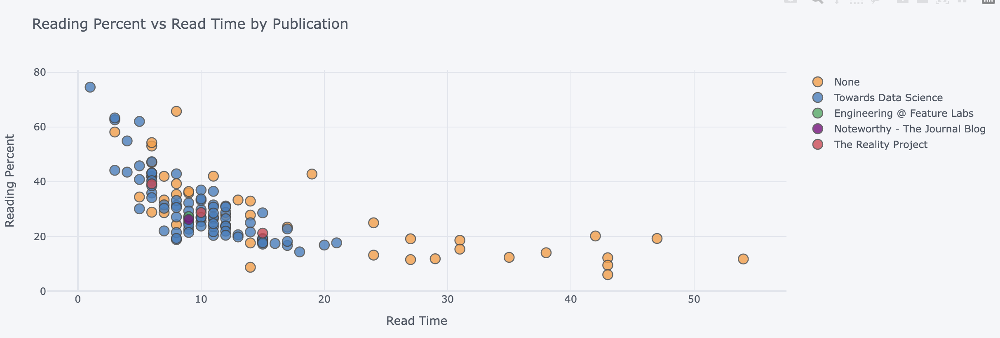
&emsp;&emsp;我们也可以很方便的设置layout来控制图片的输出，具体如下所示：

``` python 
df.iplot(
    x="word_count",
    y="views",
    categories="publication",
    mode="markers",
    text="title",
    size=8,
    layout=dict(
        xaxis=dict(title="Word Count"),
        yaxis=dict(title="Views"),
        title="Views vs Word Count by Publication",
    ),
)
```


&emsp;&emsp;如果想要某个变量来控制图片的大小显示，同时需要对气泡的图片添加text文字，具体的操作如下所示：
``` python 
text = [
    f"Title: {t} <br> Ratio: {r:.2f}%" for t, r in zip(tds["title"], tds["read_ratio"])
]

tds.iplot(
    x="word_count",
    y="reads",
    opacity=0.8,
    size=tds["read_ratio"],
    text=text,
    mode="markers",
    theme="pearl",
    layout=dict(
        xaxis=dict(type="log", title="Word Count"),
        yaxis=dict(title="Reads"),
        title="Reads vs Log Word Count Sized by Read Ratio",
    ),
)

```
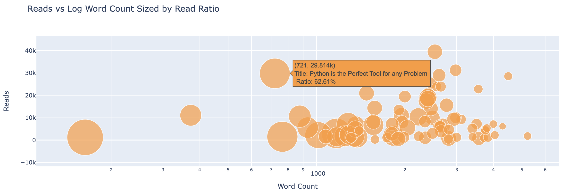

## 🔍 4. 注意事项
- Plotly的go.Scatter函数中的mode参数设置为'lines+markers'，表示同时显示折线和数据点标记。
- update_layout方法用于定制图表的布局，如标题、轴标签等。
- Plotly图表默认在网页中显示，可以在多种环境下进行交互操作。
- 确保时间序列数据正确处理，使用Pandas的date_range生成日期范围。
## 🔍 5. 总结
&emsp;&emsp;Plotly提供了一种现代且交互式的方式来创建折线图，它不仅能够展示数据的趋势，还能够提供丰富的用户交互体验。通过本博客的代码示例，我们学习了如何使用Plotly绘制折线图，并定制图表的样式和布局。希望这篇博客能够帮助你更好地利用Plotly进行动态数据可视化。


# Plotly-柱状图
## 🎯 1. 基本介绍
&emsp;&emsp;柱状图是一种常用的数据可视化手段，用于展示不同类别的数据对比。Plotly是一个强大的图表库，它可以创建交互式的柱状图，允许用户通过悬停、点击等操作来探索数据。
## 🔍 2. 画图实践
### 2.1 数据准备
&emsp;&emsp; 我们准备的数据格式如下所示：
```python
# plotly standard imports
import plotly.graph_objs as go
import chart_studio.plotly as py

# Cufflinks wrapper on plotly
import cufflinks

# Data science imports
import pandas as pd
import numpy as np

# Options for pandas
pd.options.display.max_columns = 30

# Display all cell outputs
from IPython.core.interactiveshell import InteractiveShell

InteractiveShell.ast_node_interactivity = "all"

from plotly.offline import iplot
import time
cufflinks.go_offline()

# Set global theme
cufflinks.set_config_file(world_readable=True, theme="pearl")


user_id	item_id	category	behavior	time	date	hour
0	565283	1691396	903809	pv	1512116234	2017-12-01	16
1	312117	4381601	982926	pv	1511829760	2017-11-28	8
2	253828	5082804	2885642	pv	1512228469	2017-12-02	23
3	776488	5048431	4801426	pv	1512302885	2017-12-03	20
4	884522	1649923	4145813	pv	1511870178	2017-11-28	19
5	502737	4275081	600175	pv	1511701857	2017-11-26	21
6	986023	4355178	3898483	pv	1511707644	2017-11-26	22
7	103840	3793189	317735	pv	1511961741	2017-11-29	21
8	397937	3642490	2520377	pv	1512289398	2017-12-03	16
9	1986	1400268	2520377	pv	1511693349	2017-11-26	18
10	784120	5019683	4145813	pv	1512089120	2017-12-01	8
11	865508	2359495	982926	pv	1511685415	2017-11-26	16

```
### 2.2 画图实践
&emsp;&emsp; 我们根据上述的数据画出不同种类的统计柱状图，具体的代码如下所示：
``` python 
data_item_oper.iplot(x='buy_counts',
    y='item_count',
    kind='bar',
    mode="lines+markers",
    opacity=0.5,
    size=8,
    symbol=1,
    xTitle="item种类",
    yTitle="count",
    title=go.layout.Title(text="不同种类的行为次数" ,x=0.5)
    # title="每年用户量与时间变化趋势"
)
```
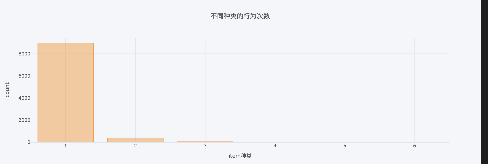

&emsp;&emsp;如果数据是两列，则可以用如下的方法：
``` python 
	views	reads
published_date		
2017-06-30	463.666667	112.333333
2017-07-31	5521.333333	1207.166667
2017-08-31	6242.800000	993.700000
2017-09-30	2113.000000	279.000000
2017-10-31	NaN	NaN

df.iplot(
    kind='bar',
    xTitle='Date',
    yTitle='Average',
    title='Monthly Average Views and Reads')
```


## 🔍 3. 注意事项
- 使用go.Bar可以创建柱状图，其中x参数表示类别，y参数表示数值。
- update_layout方法用于定制图表的布局，包括标题、轴标签和模板。
- Plotly图表默认在网页中显示，可以进行缩放、拖动等交互操作。
- 在展示大量类别时，可能需要调整图表的尺寸或字体大小，以确保所有信息都清晰可见。
## 🔍 4. 总结
&emsp;&emsp;Plotly的柱状图为数据的可视化提供了一种直观且交互性强的方式。通过本博客的代码示例，我们学习了如何使用Plotly绘制柱状图，并定制图表的样式和布局。希望这篇博客能够帮助你更好地利用Plotly进行数据可视化，使你的数据展示更加生动和有趣。


# Plotly-箱型图
## 🎯 1. 基本介绍
&emsp;&emsp;箱型图（Boxplot）是一种用于展示一组数据分布特征的统计图表，它能够提供数据的最小值、第一四分位数（Q1）、中位数（Q2）、第三四分位数（Q3）和最大值的摘要信息，并且可以直观地识别出数据中的异常值。Plotly是一个强大的图表库，它可以创建交互式的箱型图，增强了数据探索的能力。
## 🔍 2. 原理介绍
&emsp;&emsp;箱型图的构成基于以下统计量：
>- 最小值：数据集中的最小非异常值。
第一四分位数（Q1）：数据集中25%位置的值。
中位数（Q2，Median）：数据集中50%位置的值。
第三四分位数（Q3）：数据集中75%位置的值。
最大值：数据集中的最大非异常值。
四分位距（Interquartile Range, IQR）：Q3与Q1之间的差值。
## 🔍 3. 画图实践
### 3.1 数据准备
&emsp;&emsp; 我们准备的数据格式如下所示：
```python
# plotly standard imports
import plotly.graph_objs as go
import chart_studio.plotly as py

# Cufflinks wrapper on plotly
import cufflinks

# Data science imports
import pandas as pd
import numpy as np

# Options for pandas
pd.options.display.max_columns = 30

# Display all cell outputs
from IPython.core.interactiveshell import InteractiveShell

InteractiveShell.ast_node_interactivity = "all"

from plotly.offline import iplot
import time
cufflinks.go_offline()

# Set global theme
cufflinks.set_config_file(world_readable=True, theme="pearl")


	claps	days_since_publication	fans	link	num_responses	publication	published_date	read_ratio	read_time	reads	started_date	tags	text	title	title_word_count	type	views	word_count	claps_per_word	editing_days	<tag>Education	<tag>Data Science	<tag>Towards Data Science	<tag>Machine Learning	<tag>Python
119	2	574.858594	2	https://medium.com/p/screw-the-environment-but...	0	None	2017-06-10 14:25:00	41.98	7	68	2017-06-10 14:24:00	[Climate Change, Economics]	Screw the Environment, but Consider Your Walle...	Screw the Environment, but Consider Your Wallet	8	published	162	1859	0.001076	0	0	0	0	0	0
118	18	567.540639	3	https://medium.com/p/the-vanquishing-of-war-pl...	0	None	2017-06-17 22:02:00	32.93	14	54	2017-06-17 22:02:00	[Climate Change, Humanity, Optimism, History]	The Vanquishing of War, Plague and Famine Part...	The Vanquishing of War, Plague and Famine	8	published	164	3891	0.004626	0	0	0	0	0	0
121	50	554.920762	19	https://medium.com/p/capstone-project-mercedes...	0	None	2017-06-30 12:55:00	20.19	42	215	2017-06-30 12:00:00	[Machine Learning, Python, Udacity, Kaggle]	Capstone Project: Mercedes-Benz Greener Manufa...	Capstone Project: Mercedes-Benz Greener Manufa...	7	published	1065	12025	0.004158	0	0	0	0	1	1
122	0	554.078160	0	https://medium.com/p/home-of-the-scared-5af0fe...	0	None	2017-07-01 09:08:00	35.85	9	19	2017-06-30 18:21:00	[Politics, Books, News, Media Criticism]	Home of the Scared A review of A Culture of Fe...	Home of the Scared	4	published	53	2533	0.000000	0	0	0	0	0	0
114	0	550.090507	0	https://medium.com/p/the-triumph-of-peace-f485...	0

```
### 3.2 画图实践
&emsp;&emsp; 我们根据上述的数据画出不同种类的统计柱状图，具体的代码如下所示：
``` python 
df[df["read_time"] <= 10].pivot(columns="read_time", values="reads").iplot(
    kind="box",
    colorscale="set2",
    xTitle="Read Time",
    yTitle="Number of Reads",
    title="Box Plot of Reads by Reading Time",
)
```
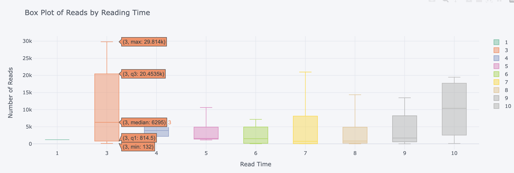

&emsp;&emsp;如果数据是两列，则可以用如下的方法：
``` python 
df[["claps", "fans"]].iplot(
    secondary_y="fans",
    secondary_y_title="Fans",
    kind="box",
    yTitle="Claps",
    title="Box Plot of Claps and Fans",
)
```
!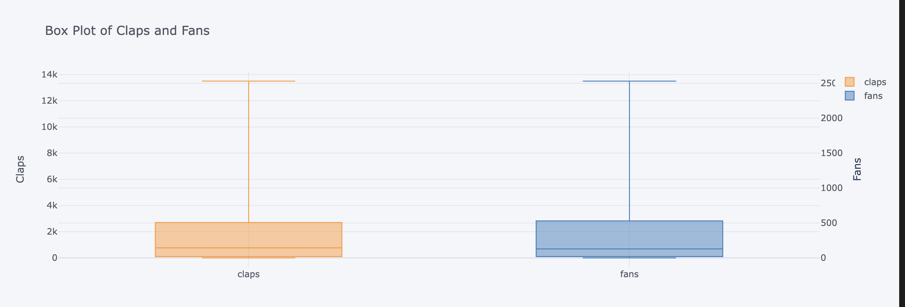

## 🔍 4. 注意事项
- go.Box中的boxpoints参数设置为'outliers'，表示只显示异常值。
- jitter参数用于在箱型图中为异常值添加轻微的随机偏移，以避免重叠。
- update_layout方法用于定制图表的布局，包括标题、轴标签和模板。
- Plotly图表默认在网页中显示，可以进行缩放、拖动等交互操作。
## 🔍 5. 总结
&emsp;&emsp;Plotly的箱型图为数据的分布特征提供了一种直观且交互性强的展示方式。通过本博客的代码示例，我们学习了如何使用Plotly绘制箱型图，并定制图表的样式和布局。希望这篇博客能够帮助你更好地利用Plotly进行数据探索和分析。


# Plotly-create_scatterplotmatrix多变量关系
## 🎯 1. 基本介绍
&emsp;&emsp;create_scatterplotmatrix 是 Plotly 中的一个函数，用于创建散点图矩阵，它允许用户在一个图表中可视化数据集中多个变量之间的两两关系。这对于初步的数据探索和理解变量间的相关性非常有用。
## 🔍 2. 原理介绍
&emsp;&emsp;散点图矩阵背后的数学原理是简单的：对于每一对变量，它绘制一个散点图，其中一变量作为 x 轴，另一变量作为 y 轴。没有特定的公式推导，但是理解散点图中的相关性、趋势和异常值对于分析是有帮助的。
## 🔍 3. 画图实践
### 3.1 数据准备
&emsp;&emsp; 我们准备的数据格式如下所示：
```python
# plotly standard imports
import plotly.graph_objs as go
import chart_studio.plotly as py

# Cufflinks wrapper on plotly
import cufflinks

# Data science imports
import pandas as pd
import numpy as np

# Options for pandas
pd.options.display.max_columns = 30

# Display all cell outputs
from IPython.core.interactiveshell import InteractiveShell

InteractiveShell.ast_node_interactivity = "all"

from plotly.offline import iplot
import time
cufflinks.go_offline()

# Set global theme
cufflinks.set_config_file(world_readable=True, theme="pearl")


	claps	days_since_publication	fans	link	num_responses	publication	published_date	read_ratio	read_time	reads	started_date	tags	text	title	title_word_count	type	views	word_count	claps_per_word	editing_days	<tag>Education	<tag>Data Science	<tag>Towards Data Science	<tag>Machine Learning	<tag>Python
119	2	574.858594	2	https://medium.com/p/screw-the-environment-but...	0	None	2017-06-10 14:25:00	41.98	7	68	2017-06-10 14:24:00	[Climate Change, Economics]	Screw the Environment, but Consider Your Walle...	Screw the Environment, but Consider Your Wallet	8	published	162	1859	0.001076	0	0	0	0	0	0
118	18	567.540639	3	https://medium.com/p/the-vanquishing-of-war-pl...	0	None	2017-06-17 22:02:00	32.93	14	54	2017-06-17 22:02:00	[Climate Change, Humanity, Optimism, History]	The Vanquishing of War, Plague and Famine Part...	The Vanquishing of War, Plague and Famine	8	published	164	3891	0.004626	0	0	0	0	0	0
121	50	554.920762	19	https://medium.com/p/capstone-project-mercedes...	0	None	2017-06-30 12:55:00	20.19	42	215	2017-06-30 12:00:00	[Machine Learning, Python, Udacity, Kaggle]	Capstone Project: Mercedes-Benz Greener Manufa...	Capstone Project: Mercedes-Benz Greener Manufa...	7	published	1065	12025	0.004158	0	0	0	0	1	1
122	0	554.078160	0	https://medium.com/p/home-of-the-scared-5af0fe...	0	None	2017-07-01 09:08:00	35.85	9	19	2017-06-30 18:21:00	[Politics, Books, News, Media Criticism]	Home of the Scared A review of A Culture of Fe...	Home of the Scared	4	published	53	2533	0.000000	0	0	0	0	0	0
114	0	550.090507	0	https://medium.com/p/the-triumph-of-peace-f485...	0

```
### 3.2 画图实践
&emsp;&emsp; 我们根据上述的数据画出不同种类的统计柱状图，具体的代码如下所示：
``` python 
import plotly.figure_factory as ff

figure = ff.create_scatterplotmatrix(
    df[["claps", "publication", "views", "read_ratio", "word_count"]],
    height=1000,
    width=1000,
    text=df["title"],
    diag="histogram",
    index="publication",
)
iplot(figure)
```
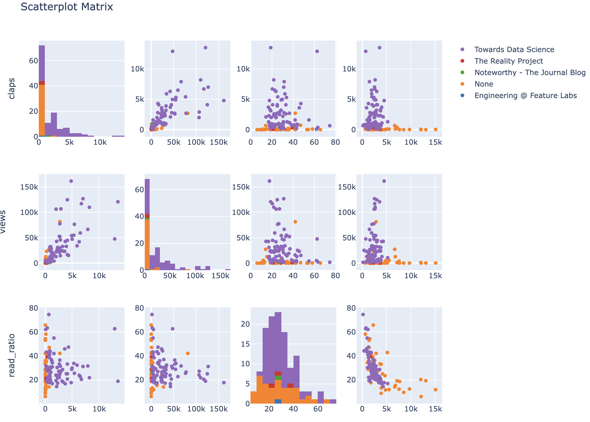
## 🔍 4. 注意事项
- create_scatterplotmatrix 函数是 Plotly Express 模块的一部分，它提供了一个高级接口来绘制散点图矩阵。
- 通过 dimensions 参数指定要包含在散点图矩阵中的变量。
- color 参数用于指定一个分类变量，以便在散点图中以不同颜色区分不同的类别。
- 散点图矩阵可以变得相当复杂，特别是当变量数量较多时。确保图表的可读性，可能需要调整大小、颜色和标签。
## 🔍 5. 总结
&emsp;&emsp;Plotly 的 create_scatterplotmatrix 函数是一个强大的工具，用于快速探索多个变量之间的关系。通过本博客的代码示例，我们学习了如何使用这个函数绘制散点图矩阵，并分析了数据集中变量间的相互作用。希望这篇博客能够帮助你更好地利用 Plotly 进行多变量数据的可视化分析。


# Plotly-heatmap热力图
## 🎯 1. 基本介绍
&emsp;&emsp;热力图是一种通过颜色变化展示数据矩阵中数值大小的图表，常用于展示变量间的相关性或数据分布模式。Plotly是一个交互式图表库，它能够创建美观且功能丰富的热力图，允许用户通过悬停查看具体数值，缩放图表等。
## 🔍 2. 原理介绍
&emsp;&emsp;热力图的生成不依赖于复杂的数学公式，但理解其背后的数据表示方式是重要的：

- 颜色映射：数据值映射到颜色空间，通常使用渐变色来表示数值的大小。
- 矩阵布局：数据以矩阵形式排列，每个单元格的数值通过颜色深浅展示。
## 🔍 3. 画图实践
### 3.1 数据准备
&emsp;&emsp; 我们准备的数据格式如下所示：
```python
# plotly standard imports
import plotly.graph_objs as go
import chart_studio.plotly as py

# Cufflinks wrapper on plotly
import cufflinks

# Data science imports
import pandas as pd
import numpy as np

# Options for pandas
pd.options.display.max_columns = 30

# Display all cell outputs
from IPython.core.interactiveshell import InteractiveShell

InteractiveShell.ast_node_interactivity = "all"

from plotly.offline import iplot
import time
cufflinks.go_offline()

# Set global theme
cufflinks.set_config_file(world_readable=True, theme="pearl")


	claps	days_since_publication	fans	link	num_responses	publication	published_date	read_ratio	read_time	reads	started_date	tags	text	title	title_word_count	type	views	word_count	claps_per_word	editing_days	<tag>Education	<tag>Data Science	<tag>Towards Data Science	<tag>Machine Learning	<tag>Python
119	2	574.858594	2	https://medium.com/p/screw-the-environment-but...	0	None	2017-06-10 14:25:00	41.98	7	68	2017-06-10 14:24:00	[Climate Change, Economics]	Screw the Environment, but Consider Your Walle...	Screw the Environment, but Consider Your Wallet	8	published	162	1859	0.001076	0	0	0	0	0	0
118	18	567.540639	3	https://medium.com/p/the-vanquishing-of-war-pl...	0	None	2017-06-17 22:02:00	32.93	14	54	2017-06-17 22:02:00	[Climate Change, Humanity, Optimism, History]	The Vanquishing of War, Plague and Famine Part...	The Vanquishing of War, Plague and Famine	8	published	164	3891	0.004626	0	0	0	0	0	0
121	50	554.920762	19	https://medium.com/p/capstone-project-mercedes...	0	None	2017-06-30 12:55:00	20.19	42	215	2017-06-30 12:00:00	[Machine Learning, Python, Udacity, Kaggle]	Capstone Project: Mercedes-Benz Greener Manufa...	Capstone Project: Mercedes-Benz Greener Manufa...	7	published	1065	12025	0.004158	0	0	0	0	1	1
122	0	554.078160	0	https://medium.com/p/home-of-the-scared-5af0fe...	0	None	2017-07-01 09:08:00	35.85	9	19	2017-06-30 18:21:00	[Politics, Books, News, Media Criticism]	Home of the Scared A review of A Culture of Fe...	Home of the Scared	4	published	53	2533	0.000000	0	0	0	0	0	0
114	0	550.090507	0	https://medium.com/p/the-triumph-of-peace-f485...	0

```
### 3.2 画图实践
&emsp;&emsp; 我们根据上述的数据画出不同种类的统计柱状图，具体的代码如下所示：
``` python 
colorscales = [
    "Greys",
    "YlGnBu",
    "Greens",
    "YlOrRd",
    "Bluered",
    "RdBu",
    "Reds",
    "Blues",
    "Picnic",
    "Rainbow",
    "Portland",
    "Jet",
    "Hot",
    "Blackbody",
    "Earth",
    "Electric",
    "Viridis",
    "Cividis",
]
corrs = df.corr()

figure = ff.create_annotated_heatmap(
    z=corrs.values,
    x=list(corrs.columns),
    y=list(corrs.index),
    colorscale="Earth",
    annotation_text=corrs.round(2).values,
    showscale=True,
    reversescale=True,
)

figure.layout.margin = dict(l=200, t=200)
figure.layout.height = 800
figure.layout.width = 1000

iplot(figure)

```
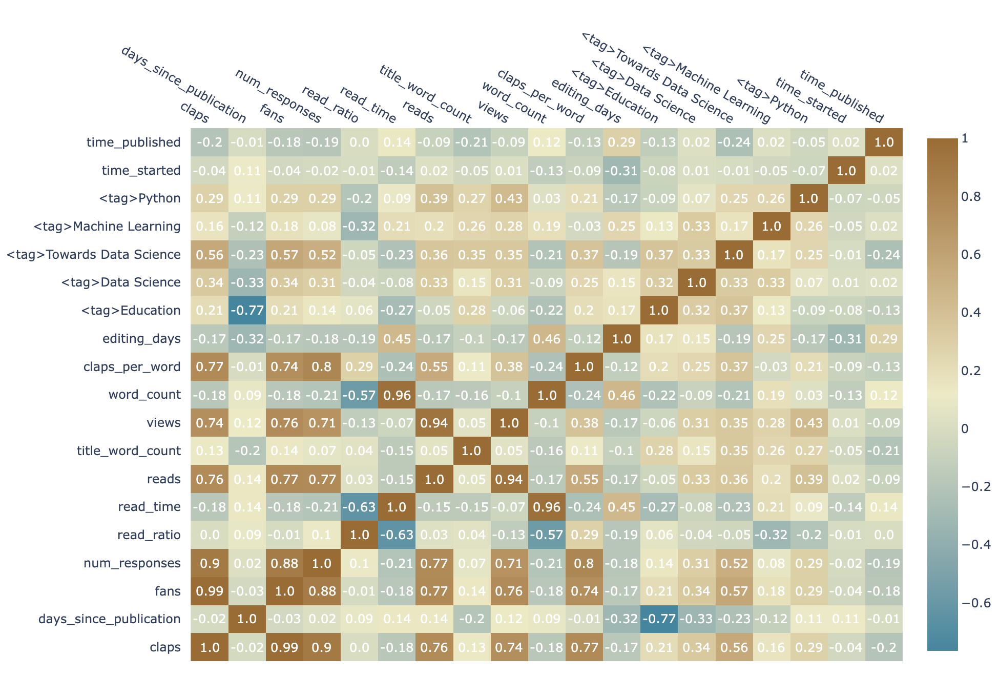
## 🔍 4. 注意事项
- 热力图中的z参数代表数据矩阵，x和y参数定义了矩阵的行和列标签。
- 可以通过colorscale参数自定义颜色映射方案，Plotly提供了多种预设的颜色方案。
- 使用hoverinfo参数可以控制鼠标悬停时显示的信息，例如可以设置为'z'以显示单元格的数值。
- 对于大数据集，可能需要调整热力图的性能设置，如降低颜色分辨率。
## 🔍 5. 总结
&emsp;&emsp;Plotly的热力图是探索和展示变量间关系的有力工具。通过本博客的代码示例，我们学习了如何使用Plotly绘制热力图，并定制图表的样式和布局。希望这篇博客能够帮助你更好地利用热力图进行数据可视化和分析。


# Plotly-流量漏斗图
## 🎯 1. 基本介绍
&emsp;&emsp;流量漏斗图是一种用于展示用户在完成某个目标的过程中，各个阶段的转化率和流失率的图表。它可以帮助我们理解用户行为，并识别转化过程中的瓶颈。Plotly是一个强大的图表库，它能够创建交互式的流量漏斗图，使得数据探索更加直观和动态。
## 🔍 2. 原理介绍
&emsp;&emsp;流量漏斗图的核心在于计算每个阶段的用户转化率和流失率。转化率可以使用以下公式计算：
$$转化率=( 阶段的离开用户数/阶段的进入用户数)×100%$$
$$流失率=100%−转化率$$
## 🔍 3. 画图实践
### 3.1 数据准备
&emsp;&emsp; 我们准备的数据格式如下所示：
```python

df
阶段	数量
0	访问网站	1000
1	注册账号	800
2	购买商品	500
3	完成购买	
```
### 3.2 画图实践
&emsp;&emsp; 我们根据上述的数据画出流量漏斗图，具体的代码如下所示：
``` python 
import plotly.graph_objects as go
import pandas as pd
import plotly.express as px

data = {'阶段': ['访问网站', '注册账号', '购买商品', '完成购买'],
        '数量': [1000, 800, 500, 300]}
df = pd.DataFrame(data)

fig = px.funnel(
    df[::-1],
    y = '阶段',
    x = '数量',
    color='阶段'
)

fig.show()

```
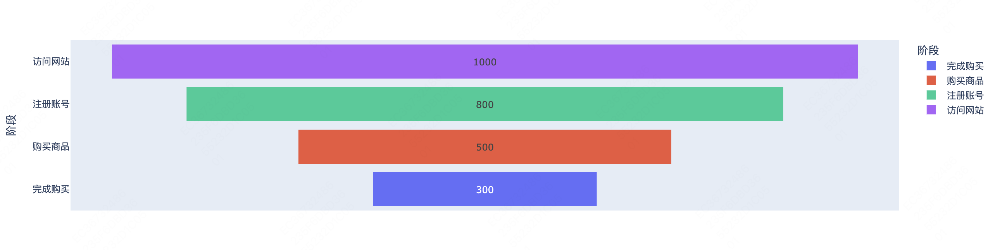
## 🔍 4. 注意事项
- Plotly的go.Funnel函数用于创建漏斗图的各个阶段。
- 通过调整baseratio参数，可以控制漏斗图的形状和大小。
- 确保数据的准确性，以便正确地反映用户在各个阶段的转化和流失情况。
## 🔍 5. 总结
&emsp;&emsp;Plotly的流量漏斗图为展示和分析用户转化过程提供了一种直观和交互式的方法。通过本博客的代码示例，我们学习了如何使用Plotly绘制流量漏斗图，并计算了各个阶段的转化率和流失率。希望这篇博客能够帮助你更好地利用Plotly进行数据可视化和用户行为分析。


# Plotly-pie饼图
## 🎯 1. 基本介绍
&emsp;&emsp;饼图是一种用于展示数据占比的图表，通过将圆分成多个扇形，每个扇形的角度和面积表示数据的比例。Plotly是一个流行的图表库，它能够创建交互式的饼图，允许用户探索数据的分布。
## 🔍 2. 原理介绍
&emsp;&emsp;饼图的每个扇形由中心角决定，中心角的大小与数据值成比例。如果θ表示中心角，v表示数据值，n表示数据总数，那么：
$$\sigma=\frac{v}{n}*360$$
## 🔍 3. 画图实践
### 3.1 数据准备
&emsp;&emsp; 我们准备的数据格式如下所示：
```python
# plotly standard imports
import plotly.graph_objs as go
import chart_studio.plotly as py

# Cufflinks wrapper on plotly
import cufflinks

# Data science imports
import pandas as pd
import numpy as np

# Options for pandas
pd.options.display.max_columns = 30

# Display all cell outputs
from IPython.core.interactiveshell import InteractiveShell

InteractiveShell.ast_node_interactivity = "all"

from plotly.offline import iplot
import time
cufflinks.go_offline()

# Set global theme
cufflinks.set_config_file(world_readable=True, theme="pearl")


	claps	days_since_publication	fans	link	num_responses	publication	published_date	read_ratio	read_time	reads	started_date	tags	text	title	title_word_count	type	views	word_count	claps_per_word	editing_days	<tag>Education	<tag>Data Science	<tag>Towards Data Science	<tag>Machine Learning	<tag>Python
119	2	574.858594	2	https://medium.com/p/screw-the-environment-but...	0	None	2017-06-10 14:25:00	41.98	7	68	2017-06-10 14:24:00	[Climate Change, Economics]	Screw the Environment, but Consider Your Walle...	Screw the Environment, but Consider Your Wallet	8	published	162	1859	0.001076	0	0	0	0	0	0
118	18	567.540639	3	https://medium.com/p/the-vanquishing-of-war-pl...	0	None	2017-06-17 22:02:00	32.93	14	54	2017-06-17 22:02:00	[Climate Change, Humanity, Optimism, History]	The Vanquishing of War, Plague and Famine Part...	The Vanquishing of War, Plague and Famine	8	published	164	3891	0.004626	0	0	0	0	0	0
121	50	554.920762	19	https://medium.com/p/capstone-project-mercedes...	0	None	2017-06-30 12:55:00	20.19	42	215	2017-06-30 12:00:00	[Machine Learning, Python, Udacity, Kaggle]	Capstone Project: Mercedes-Benz Greener Manufa...	Capstone Project: Mercedes-Benz Greener Manufa...	7	published	1065	12025	0.004158	0	0	0	0	1	1
122	0	554.078160	0	https://medium.com/p/home-of-the-scared-5af0fe...	0	None	2017-07-01 09:08:00	35.85	9	19	2017-06-30 18:21:00	[Politics, Books, News, Media Criticism]	Home of the Scared A review of A Culture of Fe...	Home of the Scared	4	published	53	2533	0.000000	0	0	0	0	0	0
114	0	550.090507	0	https://medium.com/p/the-triumph-of-peace-f485...	0

```
### 3.2 画图实践
&emsp;&emsp; 我们根据上述的数据画出不同种类的统计柱状图，具体的代码如下所示：
``` python 
df.groupby("publication", as_index=False)["word_count"].sum().iplot(
    kind="pie",
    labels="publication",
    values="word_count",
    title="Percentage of Words by Publication",
)

```
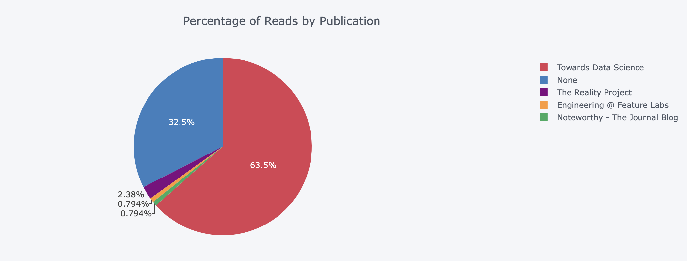
## 🔍 4. 注意事项
- 饼图适用于展示分类数据的比例，但当分类过多时，饼图可能变得难以阅读。
- 使用go.Pie创建饼图时，labels参数表示分类标签，values参数表示每个分类的数值。
- Plotly饼图支持多种自定义选项，如颜色、标题、图例等。
- 交互式饼图允许用户悬停查看每个扇形的具体数值。
## 🔍 5. 总结
&emsp;&emsp;Plotly的饼图为展示数据占比提供了一种直观且交互性强的方式。通过本博客的代码示例，我们学习了如何使用Plotly绘制饼图，并定制图表的样式和布局。希望这篇博客能够帮助你更好地利用饼图进行数据可视化，使你的数据展示更加生动和有趣。
